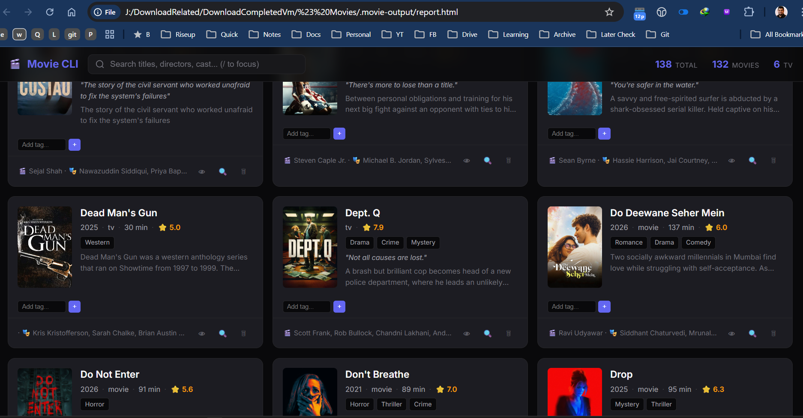

<div align="center">


# 🎬 Movie CLI

**Personal movie & TV show library manager — from the terminal**

[](https://github.com/alimtvnetwork/movie-cli-v7/actions/workflows/ci.yml)
[](https://github.com/alimtvnetwork/movie-cli-v7/actions/workflows/release.yml)
[](https://github.com/alimtvnetwork/movie-cli-v7/releases)
[](https://github.com/alimtvnetwork/movie-cli-v7/releases)
[](https://go.dev/)
[](https://github.com/alimtvnetwork/movie-cli-v7)
[](https://www.sqlite.org/)
[](https://goreportcard.com/report/github.com/alimtvnetwork/movie-cli-v7)
[](https://github.com/alimtvnetwork/movie-cli-v7/commits/main)
[](https://github.com/alimtvnetwork/movie-cli-v7)
[](https://github.com/alimtvnetwork/movie-cli-v7/issues)
[](https://github.com/alimtvnetwork/movie-cli-v7/stargazers)
[](CONTRIBUTING.md)
[](LICENSE)

_Scan folders, clean filenames, fetch TMDb metadata, organize files, and track your collection._

<br>


<sub>↑ One command, one binary — scan, match against TMDb, and organize your whole library.</sub>

<br><br>



<sub>↑ Every <code>mahin scan</code> writes <code>.movie-output/report.html</code> and opens it in your default browser automatically.</sub>

<br><br>

<!-- README-INSTALL:BEGIN -->
**🚀 Install in 10 seconds — anyone, any OS:**

<table>
<tr>
<td><b>🪟 Windows · PowerShell</b></td>
<td>

```powershell
irm https://raw.githubusercontent.com/alimtvnetwork/movie-cli-v7/main/get.ps1 | iex
```

</td>
</tr>
<tr>
<td><b>🐧 macOS · Linux · Bash</b></td>
<td>

```bash
curl -fsSL https://raw.githubusercontent.com/alimtvnetwork/movie-cli-v7/main/get.sh | bash
```

</td>
</tr>
</table>

<sub>Auto-detects your OS &amp; architecture · Installs the latest pre-built binary · Falls back to a source build if no release is published · See <a href="#installation">Installation</a> for flags, pinned versions, and verification.</sub>
<!-- README-INSTALL:END -->

</div>

---

<div align="center">

## 💡 Why this exists

</div>

If you've ever ripped years of **old DVDs** to a hard drive — or just collected
movies the slow way — you know the pain: a folder full of cryptic filenames
like `MV_0432.avi` or `the.matrix.1999.1080p.x264.mkv`, no posters, no
ratings, no idea what's actually worth watching tonight.

**Movie CLI was built out of that frustration.** It scans your existing
folders, cleans up the messy release names, matches each file against TMDb,
and gives you a real library on your own disk — with **titles, posters,
ratings, genres, cast, runtime, and watch history** — without uploading
anything to a cloud service. Your files stay where they are; you just finally
know what you have.

---

<div align="center">

## ✨ Highlights

</div>

- 🔍 **Smart scan** — recursively walks folders, cleans messy release names, and matches them against TMDb
- 🖼️ **Posters & metadata** — automatic thumbnail downloads, ratings, genres, cast, runtime
- 📦 **Single binary** — one statically-linked Go executable, no runtime, no dependencies
- 🗂️ **SQLite (WAL)** — fast, durable, zero-config local database in `./data/movie.db`
- ↩️ **Undo / redo** — every move, rename, scan, and delete is reversible
- 🌐 **REST API + web UI** — `movie rest --open` launches a local dashboard
- 🛠️ **Self-updating** — `movie update` pulls, rebuilds, and hands off in-place
- 🔒 **Cross-platform** — Windows, Linux, macOS on `amd64` and `arm64`

---

<div align="center">

## 📑 Table of Contents

</div>

- [Quick Start](#quick-start)
- [Sample setup used in this README](#sample-setup-used-in-this-readme)
- [Pre-flight checklist](#-pre-flight-checklist)
- [Jump to a command](#jump-to-a-command)
- [Demo](#-demo)
- [Installation](#installation)
- [What It Does](#what-it-does)
- [Command Reference](#command-reference)
- [Troubleshooting Flowchart](#troubleshooting)
- [Command Tree](#command-tree)
- [Build & Deploy](#build--deploy)
- [Release Workflow](#release-workflow)
- [Project Structure](#project-structure)
- [Data Storage](#data-storage)
- [Documentation sync](#documentation-sync)
- [Milestones](#milestones)
- [Dependencies](#dependencies)
- [Contributing](#-contributing)
- [Author](#author)
- [License](#license)

---

<div align="center">

## Quick Start

_In a hurry? See **[QUICKSTART.md](QUICKSTART.md)** — minimal copy-paste commands for Linux, macOS, and Windows._

</div>

### Install latest release

Picks up whatever is currently tagged `latest` on GitHub — and if no release has been published yet, automatically falls back to a source-build from `main` so you still end up with a working binary.

**Windows (PowerShell)**

```powershell
irm https://raw.githubusercontent.com/alimtvnetwork/movie-cli-v7/main/get.ps1 | iex
```

**Linux / macOS**

```bash
curl -fsSL https://raw.githubusercontent.com/alimtvnetwork/movie-cli-v7/main/get.sh | bash
```

> The bootstrap probes `releases/latest/download/install.{ps1,sh}` first. If a release exists, it installs the pre-built binary. If not, it transparently falls back to cloning and building from `main` — and prints exactly which path it took. See [Installation](#installation) for flags and details.

### Install a specific version (pinned)

Installs exactly the version in the URL — never auto-upgrades. Use this for CI pipelines, Dockerfiles, reproducible setups, or when you need to roll back. Replace `v2.130.0` with the [release tag](https://github.com/alimtvnetwork/movie-cli-v7/releases) you want.

**Windows (PowerShell)**

```powershell
irm https://github.com/alimtvnetwork/movie-cli-v7/releases/download/v2.130.0/install.ps1 | iex
```

**Linux / macOS**

```bash
curl -fsSL https://github.com/alimtvnetwork/movie-cli-v7/releases/download/v2.130.0/install.sh | bash
```

> **Which one should I use?** Use **latest** for personal machines so you stay current. Use **pinned** anywhere reproducibility matters — the pinned script is hard-locked to the version in the URL and will install that exact tag forever, even after newer releases ship. ([contract spec](spec/12-ci-cd-pipeline/06-version-pinned-install-scripts.md))

### Set up & scan

```bash
movie config set tmdb_api_key YOUR_KEY
movie scan ~/Downloads
movie ls
```

### Search & discover

```bash
movie search "Inception"
movie suggest 5
```

Every command supports `--help` or `-h` for detailed usage.

---

<div align="center">

## Sample setup used in this README

</div>

Every "Expected output" snippet below assumes the small reference setup shown here. If your library is larger or your IDs differ, only the **numbers** will change — the shape of the output stays the same.

**Folder layout** (`source_folder = /mnt/storage/Movies` on Linux/macOS, `D:\Media\Movies` on Windows):

```text
/mnt/storage/Movies/
├── Inception (2010).mkv
├── The Matrix (1999).mkv
├── Arrival (2016).mkv
├── Interstellar (2014).mkv
├── The Prestige (2006).mkv
└── _unsorted/
    ├── inception.2010.1080p.mkv      ← will be cleaned up by `movie rename`
    └── old.movie.1998.mkv             ← becomes a stale entry after deletion

/mnt/storage/Sorted/                   ← destination for `movie move`
└── Action/
```

**Config values** (set once with `movie config set <key> <value>`):

| Key | Value |
|---|---|
| `source_folder` | `/mnt/storage/Movies` |
| `tmdb_api_key` | *your TMDb v3 key* |
| `default_player` | `mpv` |
| `log_level` | `info` |

**ID → title map** (after the first `movie scan`, your IDs may differ — substitute as needed):

| ID | Title | Year | Used in section |
|---|---|---|---|
| `1` | Inception | 2010 | Discovery & Organization (`tag add 1 favorite`) |
| `123` | Inception | 2010 | Scanning & Library, File Management |
| `124` | The Matrix | 1999 | Scanning & Library |
| `125` | Arrival | 2016 | Scanning & Library |
| `131` | The Prestige | 2006 | Discovery & Organization (`suggest`) |
| `412` | Old Movie (1998) | — | Maintenance & Debugging (stale entry) |
| `418` | Removed.avi | — | Maintenance & Debugging (stale entry) |

**History entry IDs** (created by past `move` / `rename` / `scan` ops):

| History ID | Op | Target |
|---|---|---|
| `87` | move | Inception (2010).mkv → Sorted/Action |
| `86` | rename | The Matrix (1999).mkv |
| `85` | scan | /mnt/storage/Movies (12 added) |
| `42` | *generic placeholder used in `--id 42` examples* | — |

> **Tip:** run `movie ls` after your first scan to see your real media IDs, and `movie undo --list` to see your real history IDs. Replace the sample numbers above with yours when copying commands.

---

<div align="center">

## ✅ Pre-flight checklist

</div>

Run these checks **before** any command in the [Jump to a command](#jump-to-a-command) section. Each row tells you what to verify, the one-liner that confirms it, and the fix if the check fails. Tick boxes as you go.

| ✓ | What to verify | Why it matters |
|---|---|---|
| ☐ | `movie` binary is on `$PATH` | every command starts with `movie …` |
| ☐ | `tmdb_api_key` is set in config | scan / search / suggest fail without it |
| ☐ | `source_folder` is set in config | `movie scan` (no args) needs it |
| ☐ | `default_player` is set in config | `movie play <id>` needs it |
| ☐ | `source_folder` exists and contains video files | otherwise scan returns `0 added` |
| ☐ | Destination folder for `movie move` is writable | otherwise move fails with `permission denied` |
| ☐ | Port `7777` is free (or pick another with `--port`) | needed for `movie rest` |
| ☐ | Network access to `api.themoviedb.org` | needed for TMDb metadata |
| ☐ | Network access to GitHub releases | needed for `movie update` |

### 🚀 Quick bootstrap check

After installing, run two commands — the first confirms the binary is on `$PATH`, the second runs every check above automatically:

```bash
command -v movie >/dev/null && echo "✅ movie found: $(command -v movie)" || echo "❌ movie NOT on PATH"
movie doctor
```

On Windows PowerShell, the equivalent first line is:

```powershell
if (Get-Command movie -ErrorAction SilentlyContinue) { "✅ movie found: $((Get-Command movie).Source)" } else { "❌ movie NOT on PATH" }
movie doctor
```

`movie doctor` runs the config-key, source-folder, port `7777`, PATH, deploy and version checks built into the binary, prints the same ✅ / ⚠️ / ❌ output, and exits non-zero if anything fails — so it's safe to use in CI. Pass `--fix` to auto-repair fixable findings, or `--json` for machine-readable output.

> **All ✅?** You're ready to run anything in the [Jump to a command](#jump-to-a-command) section.
> **Any ❌?** Fix it first — most failures further down the README trace back to one of these checks.

> 🧾 **Diffing `readme.txt` against the Expected output blocks.** All six "✅ Expected output" snippets in the [Jump to a command](#jump-to-a-command) section are plain ` ```text ` fences, so you can pull them out with one awk pass and diff them against your generated `readme.txt`: <br>
> `awk '/^\*\*✅ Expected output\*\*/{flag=1;next} flag && /^```text/{cap=1;next} flag && cap && /^```/{cap=0;flag=0;print "---"; next} cap' README.md > expected.txt && diff -u expected.txt readme.txt | less` <br>
> On Windows PowerShell use `Compare-Object (Get-Content expected.txt) (Get-Content readme.txt)`. Lines that differ are usually just your real IDs/sizes vs the README's sample IDs (`123`, `87`, `412`) — see [Sample setup](#sample-setup-used-in-this-readme) for the mapping.

---

<div align="center">

## Jump to a command

</div>

Skip the demo and jump straight to the command you need. Each link drops you into the matching **Command Reference** subsection — with the animated walkthrough, copy-paste Bash + PowerShell examples, expected output, and the full subcommand table.

Each row has both a **Bash** and a **PowerShell** fenced block — pick the one for your shell, then **triple-click any line** (or drag-select the whole block) to copy a real, runnable command. The two blocks differ only where shell syntax matters (paths, env vars, quoting).

> 💡 **Want one-click copy?** Run `movie rest --open` to launch the dashboard, then press <kbd>Ctrl</kbd>/<kbd>⌘</kbd>+<kbd>K</kbd> to open the **command palette** — it fuzzy-searches every command in this section and copies the exact `movie …` string with one click. Single-letter shortcuts (<kbd>S</kbd>, <kbd>F</kbd>, <kbd>H</kbd>, <kbd>D</kbd>, <kbd>M</kbd>, <kbd>C</kbd>) jump to each subsection.

> 🔍 **Search this README right here.** On GitHub, press <kbd>/</kbd> to open the file-content search, or use your browser's <kbd>Ctrl</kbd>/<kbd>⌘</kbd>+<kbd>F</kbd> to find any command, flag, or section name on this page. The flat command index below is built so a single keyword (`scan`, `undo`, `tmdb_api_key`) lands on the exact row.

<details><summary><strong>🔎 Flat alphabetical command index</strong> — press <kbd>Ctrl</kbd>/<kbd>⌘</kbd>+<kbd>F</kbd> and type any keyword</summary>

One line per command. Search lands on the exact row; the section name on the right tells you where to jump.

**Click the command** to jump straight to its README subsection (with the bash/PowerShell blocks, args, expected output, and "if it differs" notes). Each row also carries a stable anchor (e.g. `#movie-scan`, `#movie-undo-list`) shown in the rightmost column — share that fragment and links always land on the exact row. The **Example keyword** column gives you a minimal command-shaped placeholder (e.g. `movie ls --year `, `movie scan --dry-run `, `movie config set tmdb_api_key `) — paste it into <kbd>Ctrl</kbd>/<kbd>⌘</kbd>+<kbd>F</kbd> to find every place that argument pattern appears in this README (index row, usage block, expected output, and tips).

> 🔄 **Auto-generated from a single source.** `scripts/gen-command-index.py` owns the canonical command list and rewrites three things in this README on every run: (1) the HTML table + plain-text block in this section, (2) every stale link to one of the six command-section anchors (`#scanning--library`, `#file-management`, `#history--undo`, `#discovery--organization`, `#maintenance--debugging`, `#configuration--system`), and (3) the `bash` + `powershell` quick-start pair under each `#### 📂 [Section]` heading in the Command Reference (between `<!-- SECTION-CMDS:<label>:BEGIN -->` markers). Edit only the script, then run `python3 scripts/gen-command-index.py`. CI runs `--check` on every push and fails with a `file:line` annotation if anything is stale. Hand-written prose around the markers (Args / Assumptions / Expected output / If it differs) is preserved untouched.

<!-- COMMAND-INDEX:HTML:BEGIN -->
<table>
<thead><tr>
<th align="left" width="38%">Command</th>
<th align="center" width="4%">→</th>
<th align="left" width="20%">Section</th>
<th align="left" width="22%">Example keyword</th>
<th align="right" width="16%">Anchor</th>
</tr></thead>
<tbody>
<tr id="movie-cd-id"><td><a href="#file-management" title="Jump to the File Management section"><code>movie cd &lt;id&gt;</code></a></td><td align="center">→</td><td><a href="#file-management">File Management</a></td><td><code>movie cd </code></td><td align="right"><code>#movie-cd-id</code></td></tr>
<tr id="movie-changelog"><td><a href="#configuration--system" title="Jump to the Configuration & System section"><code>movie changelog</code></a></td><td align="center">→</td><td><a href="#configuration--system">Configuration & System</a></td><td><code>movie changelog</code></td><td align="right"><code>#movie-changelog</code></td></tr>
<tr id="movie-cleanup"><td><a href="#maintenance--debugging" title="Jump to the Maintenance & Debugging section"><code>movie cleanup</code></a></td><td align="center">→</td><td><a href="#maintenance--debugging">Maintenance & Debugging</a></td><td><code>movie cleanup</code></td><td align="right"><code>#movie-cleanup</code></td></tr>
<tr id="movie-config"><td><a href="#configuration--system" title="Jump to the Configuration & System section"><code>movie config</code></a></td><td align="center">→</td><td><a href="#configuration--system">Configuration & System</a></td><td><code>movie config</code></td><td align="right"><code>#movie-config</code></td></tr>
<tr id="movie-config-get-key"><td><a href="#configuration--system" title="Jump to the Configuration & System section"><code>movie config get &lt;key&gt;</code></a></td><td align="center">→</td><td><a href="#configuration--system">Configuration & System</a></td><td><code>movie config get </code></td><td align="right"><code>#movie-config-get-key</code></td></tr>
<tr id="movie-config-set-key-value"><td><a href="#configuration--system" title="Jump to the Configuration & System section"><code>movie config set &lt;key&gt; &lt;value&gt;</code></a></td><td align="center">→</td><td><a href="#configuration--system">Configuration & System</a></td><td><code>movie config set </code></td><td align="right"><code>#movie-config-set-key-value</code></td></tr>
<tr id="movie-config-set-source-folder-path"><td><a href="#configuration--system" title="Jump to the Configuration & System section"><code>movie config set source_folder &lt;path&gt;</code></a></td><td align="center">→</td><td><a href="#configuration--system">Configuration & System</a></td><td><code>movie config set source_folder </code></td><td align="right"><code>#movie-config-set-source-folder-path</code></td></tr>
<tr id="movie-config-set-tmdb-api-key-key"><td><a href="#configuration--system" title="Jump to the Configuration & System section"><code>movie config set tmdb_api_key &lt;key&gt;</code></a></td><td align="center">→</td><td><a href="#configuration--system">Configuration & System</a></td><td><code>movie config set tmdb_api_key </code></td><td align="right"><code>#movie-config-set-tmdb-api-key-key</code></td></tr>
<tr id="movie-db"><td><a href="#maintenance--debugging" title="Jump to the Maintenance & Debugging section"><code>movie db</code></a></td><td align="center">→</td><td><a href="#maintenance--debugging">Maintenance & Debugging</a></td><td><code>movie db</code></td><td align="right"><code>#movie-db</code></td></tr>
<tr id="movie-discover"><td><a href="#discovery--organization" title="Jump to the Discovery & Organization section"><code>movie discover</code></a></td><td align="center">→</td><td><a href="#discovery--organization">Discovery & Organization</a></td><td><code>movie discover</code></td><td align="right"><code>#movie-discover</code></td></tr>
<tr id="movie-duplicates"><td><a href="#file-management" title="Jump to the File Management section"><code>movie duplicates</code></a></td><td align="center">→</td><td><a href="#file-management">File Management</a></td><td><code>movie duplicates</code></td><td align="right"><code>#movie-duplicates</code></td></tr>
<tr id="movie-export"><td><a href="#maintenance--debugging" title="Jump to the Maintenance & Debugging section"><code>movie export</code></a></td><td align="center">→</td><td><a href="#maintenance--debugging">Maintenance & Debugging</a></td><td><code>movie export</code></td><td align="right"><code>#movie-export</code></td></tr>
<tr id="movie-export-format-csv-out-file"><td><a href="#maintenance--debugging" title="Jump to the Maintenance & Debugging section"><code>movie export --format csv --out &lt;file&gt;</code></a></td><td align="center">→</td><td><a href="#maintenance--debugging">Maintenance & Debugging</a></td><td><code>movie export --format csv </code></td><td align="right"><code>#movie-export-format-csv-out-file</code></td></tr>
<tr id="movie-export-format-json-out-file"><td><a href="#maintenance--debugging" title="Jump to the Maintenance & Debugging section"><code>movie export --format json --out &lt;file&gt;</code></a></td><td align="center">→</td><td><a href="#maintenance--debugging">Maintenance & Debugging</a></td><td><code>movie export --format json </code></td><td align="right"><code>#movie-export-format-json-out-file</code></td></tr>
<tr id="movie-hello"><td><a href="#configuration--system" title="Jump to the Configuration & System section"><code>movie hello</code></a></td><td align="center">→</td><td><a href="#configuration--system">Configuration & System</a></td><td><code>movie hello</code></td><td align="right"><code>#movie-hello</code></td></tr>
<tr id="movie-info-id"><td><a href="#scanning--library" title="Jump to the Scanning & Library section"><code>movie info &lt;id&gt;</code></a></td><td align="center">→</td><td><a href="#scanning--library">Scanning & Library</a></td><td><code>movie info </code></td><td align="right"><code>#movie-info-id</code></td></tr>
<tr id="movie-info-id-json"><td><a href="#scanning--library" title="Jump to the Scanning & Library section"><code>movie info &lt;id&gt; --json</code></a></td><td align="center">→</td><td><a href="#scanning--library">Scanning & Library</a></td><td><code>movie info --json </code></td><td align="right"><code>#movie-info-id-json</code></td></tr>
<tr id="movie-logs"><td><a href="#maintenance--debugging" title="Jump to the Maintenance & Debugging section"><code>movie logs</code></a></td><td align="center">→</td><td><a href="#maintenance--debugging">Maintenance & Debugging</a></td><td><code>movie logs</code></td><td align="right"><code>#movie-logs</code></td></tr>
<tr id="movie-ls"><td><a href="#scanning--library" title="Jump to the Scanning & Library section"><code>movie ls</code></a></td><td align="center">→</td><td><a href="#scanning--library">Scanning & Library</a></td><td><code>movie ls</code></td><td align="right"><code>#movie-ls</code></td></tr>
<tr id="movie-ls-genre-name"><td><a href="#scanning--library" title="Jump to the Scanning & Library section"><code>movie ls --genre &lt;name&gt;</code></a></td><td align="center">→</td><td><a href="#scanning--library">Scanning & Library</a></td><td><code>movie ls --genre </code></td><td align="right"><code>#movie-ls-genre-name</code></td></tr>
<tr id="movie-ls-limit-n"><td><a href="#scanning--library" title="Jump to the Scanning & Library section"><code>movie ls --limit &lt;n&gt;</code></a></td><td align="center">→</td><td><a href="#scanning--library">Scanning & Library</a></td><td><code>movie ls --limit </code></td><td align="right"><code>#movie-ls-limit-n</code></td></tr>
<tr id="movie-ls-year-yyyy-sort-field"><td><a href="#scanning--library" title="Jump to the Scanning & Library section"><code>movie ls --year &lt;yyyy&gt; --sort &lt;field&gt;</code></a></td><td align="center">→</td><td><a href="#scanning--library">Scanning & Library</a></td><td><code>movie ls --year </code></td><td align="right"><code>#movie-ls-year-yyyy-sort-field</code></td></tr>
<tr id="movie-move"><td><a href="#file-management" title="Jump to the File Management section"><code>movie move</code></a></td><td align="center">→</td><td><a href="#file-management">File Management</a></td><td><code>movie move</code></td><td align="right"><code>#movie-move</code></td></tr>
<tr id="movie-move-all"><td><a href="#file-management" title="Jump to the File Management section"><code>movie move --all</code></a></td><td align="center">→</td><td><a href="#file-management">File Management</a></td><td><code>movie move --all</code></td><td align="right"><code>#movie-move-all</code></td></tr>
<tr id="movie-move-id-to-path"><td><a href="#file-management" title="Jump to the File Management section"><code>movie move &lt;id&gt; --to &lt;path&gt;</code></a></td><td align="center">→</td><td><a href="#file-management">File Management</a></td><td><code>movie move --to </code></td><td align="right"><code>#movie-move-id-to-path</code></td></tr>
<tr id="movie-play-id"><td><a href="#file-management" title="Jump to the File Management section"><code>movie play &lt;id&gt;</code></a></td><td align="center">→</td><td><a href="#file-management">File Management</a></td><td><code>movie play </code></td><td align="right"><code>#movie-play-id</code></td></tr>
<tr id="movie-play-id-player-bin"><td><a href="#file-management" title="Jump to the File Management section"><code>movie play &lt;id&gt; --player &lt;bin&gt;</code></a></td><td align="center">→</td><td><a href="#file-management">File Management</a></td><td><code>movie play --player </code></td><td align="right"><code>#movie-play-id-player-bin</code></td></tr>
<tr id="movie-popout"><td><a href="#file-management" title="Jump to the File Management section"><code>movie popout</code></a></td><td align="center">→</td><td><a href="#file-management">File Management</a></td><td><code>movie popout</code></td><td align="right"><code>#movie-popout</code></td></tr>
<tr id="movie-redo"><td><a href="#history--undo" title="Jump to the History & Undo section"><code>movie redo</code></a></td><td align="center">→</td><td><a href="#history--undo">History & Undo</a></td><td><code>movie redo</code></td><td align="right"><code>#movie-redo</code></td></tr>
<tr id="movie-rename"><td><a href="#file-management" title="Jump to the File Management section"><code>movie rename</code></a></td><td align="center">→</td><td><a href="#file-management">File Management</a></td><td><code>movie rename</code></td><td align="right"><code>#movie-rename</code></td></tr>
<tr id="movie-rename-id"><td><a href="#file-management" title="Jump to the File Management section"><code>movie rename &lt;id&gt;</code></a></td><td align="center">→</td><td><a href="#file-management">File Management</a></td><td><code>movie rename </code></td><td align="right"><code>#movie-rename-id</code></td></tr>
<tr id="movie-rename-all-pattern-fmt"><td><a href="#file-management" title="Jump to the File Management section"><code>movie rename --all --pattern &lt;fmt&gt;</code></a></td><td align="center">→</td><td><a href="#file-management">File Management</a></td><td><code>movie rename --all --pattern </code></td><td align="right"><code>#movie-rename-all-pattern-fmt</code></td></tr>
<tr id="movie-rescan"><td><a href="#scanning--library" title="Jump to the Scanning & Library section"><code>movie rescan</code></a></td><td align="center">→</td><td><a href="#scanning--library">Scanning & Library</a></td><td><code>movie rescan</code></td><td align="right"><code>#movie-rescan</code></td></tr>
<tr id="movie-rest"><td><a href="#maintenance--debugging" title="Jump to the Maintenance & Debugging section"><code>movie rest</code></a></td><td align="center">→</td><td><a href="#maintenance--debugging">Maintenance & Debugging</a></td><td><code>movie rest</code></td><td align="right"><code>#movie-rest</code></td></tr>
<tr id="movie-rest-open"><td><a href="#maintenance--debugging" title="Jump to the Maintenance & Debugging section"><code>movie rest --open</code></a></td><td align="center">→</td><td><a href="#maintenance--debugging">Maintenance & Debugging</a></td><td><code>movie rest --open</code></td><td align="right"><code>#movie-rest-open</code></td></tr>
<tr id="movie-rest-port-n"><td><a href="#maintenance--debugging" title="Jump to the Maintenance & Debugging section"><code>movie rest --port &lt;n&gt;</code></a></td><td align="center">→</td><td><a href="#maintenance--debugging">Maintenance & Debugging</a></td><td><code>movie rest --port </code></td><td align="right"><code>#movie-rest-port-n</code></td></tr>
<tr id="movie-scan"><td><a href="#scanning--library" title="Jump to the Scanning & Library section"><code>movie scan</code></a></td><td align="center">→</td><td><a href="#scanning--library">Scanning & Library</a></td><td><code>movie scan</code></td><td align="right"><code>#movie-scan</code></td></tr>
<tr id="movie-scan-path"><td><a href="#scanning--library" title="Jump to the Scanning & Library section"><code>movie scan &lt;path&gt;</code></a></td><td align="center">→</td><td><a href="#scanning--library">Scanning & Library</a></td><td><code>movie scan </code></td><td align="right"><code>#movie-scan-path</code></td></tr>
<tr id="movie-scan-path-dry-run"><td><a href="#scanning--library" title="Jump to the Scanning & Library section"><code>movie scan &lt;path&gt; --dry-run</code></a></td><td align="center">→</td><td><a href="#scanning--library">Scanning & Library</a></td><td><code>movie scan --dry-run </code></td><td align="right"><code>#movie-scan-path-dry-run</code></td></tr>
<tr id="movie-scan-path-refresh"><td><a href="#scanning--library" title="Jump to the Scanning & Library section"><code>movie scan &lt;path&gt; --refresh</code></a></td><td align="center">→</td><td><a href="#scanning--library">Scanning & Library</a></td><td><code>movie scan --refresh </code></td><td align="right"><code>#movie-scan-path-refresh</code></td></tr>
<tr id="movie-search-query"><td><a href="#scanning--library" title="Jump to the Scanning & Library section"><code>movie search &lt;query&gt;</code></a></td><td align="center">→</td><td><a href="#scanning--library">Scanning & Library</a></td><td><code>movie search </code></td><td align="right"><code>#movie-search-query</code></td></tr>
<tr id="movie-search-query-year-yyyy"><td><a href="#scanning--library" title="Jump to the Scanning & Library section"><code>movie search &lt;query&gt; --year &lt;yyyy&gt;</code></a></td><td align="center">→</td><td><a href="#scanning--library">Scanning & Library</a></td><td><code>movie search --year </code></td><td align="right"><code>#movie-search-query-year-yyyy</code></td></tr>
<tr id="movie-stats"><td><a href="#discovery--organization" title="Jump to the Discovery & Organization section"><code>movie stats</code></a></td><td align="center">→</td><td><a href="#discovery--organization">Discovery & Organization</a></td><td><code>movie stats</code></td><td align="right"><code>#movie-stats</code></td></tr>
<tr id="movie-stats-by-dimension"><td><a href="#discovery--organization" title="Jump to the Discovery & Organization section"><code>movie stats --by &lt;dimension&gt;</code></a></td><td align="center">→</td><td><a href="#discovery--organization">Discovery & Organization</a></td><td><code>movie stats --by </code></td><td align="right"><code>#movie-stats-by-dimension</code></td></tr>
<tr id="movie-suggest"><td><a href="#discovery--organization" title="Jump to the Discovery & Organization section"><code>movie suggest</code></a></td><td align="center">→</td><td><a href="#discovery--organization">Discovery & Organization</a></td><td><code>movie suggest</code></td><td align="right"><code>#movie-suggest</code></td></tr>
<tr id="movie-suggest-genre-name-limit-n"><td><a href="#discovery--organization" title="Jump to the Discovery & Organization section"><code>movie suggest --genre &lt;name&gt; --limit &lt;n&gt;</code></a></td><td align="center">→</td><td><a href="#discovery--organization">Discovery & Organization</a></td><td><code>movie suggest --genre </code></td><td align="right"><code>#movie-suggest-genre-name-limit-n</code></td></tr>
<tr id="movie-tag-add-id-tag"><td><a href="#discovery--organization" title="Jump to the Discovery & Organization section"><code>movie tag add &lt;id&gt; &lt;tag&gt;</code></a></td><td align="center">→</td><td><a href="#discovery--organization">Discovery & Organization</a></td><td><code>movie tag add </code></td><td align="right"><code>#movie-tag-add-id-tag</code></td></tr>
<tr id="movie-tag-list-id"><td><a href="#discovery--organization" title="Jump to the Discovery & Organization section"><code>movie tag list &lt;id&gt;</code></a></td><td align="center">→</td><td><a href="#discovery--organization">Discovery & Organization</a></td><td><code>movie tag list </code></td><td align="right"><code>#movie-tag-list-id</code></td></tr>
<tr id="movie-tag-list-all"><td><a href="#discovery--organization" title="Jump to the Discovery & Organization section"><code>movie tag list --all</code></a></td><td align="center">→</td><td><a href="#discovery--organization">Discovery & Organization</a></td><td><code>movie tag list --all</code></td><td align="right"><code>#movie-tag-list-all</code></td></tr>
<tr id="movie-tag-remove-id-tag"><td><a href="#discovery--organization" title="Jump to the Discovery & Organization section"><code>movie tag remove &lt;id&gt; &lt;tag&gt;</code></a></td><td align="center">→</td><td><a href="#discovery--organization">Discovery & Organization</a></td><td><code>movie tag remove </code></td><td align="right"><code>#movie-tag-remove-id-tag</code></td></tr>
<tr id="movie-tag-remove-id-all"><td><a href="#discovery--organization" title="Jump to the Discovery & Organization section"><code>movie tag remove &lt;id&gt; --all</code></a></td><td align="center">→</td><td><a href="#discovery--organization">Discovery & Organization</a></td><td><code>movie tag remove --all</code></td><td align="right"><code>#movie-tag-remove-id-all</code></td></tr>
<tr id="movie-undo"><td><a href="#history--undo" title="Jump to the History & Undo section"><code>movie undo</code></a></td><td align="center">→</td><td><a href="#history--undo">History & Undo</a></td><td><code>movie undo</code></td><td align="right"><code>#movie-undo</code></td></tr>
<tr id="movie-undo-id-history-id"><td><a href="#history--undo" title="Jump to the History & Undo section"><code>movie undo --id &lt;history-id&gt;</code></a></td><td align="center">→</td><td><a href="#history--undo">History & Undo</a></td><td><code>movie undo --id </code></td><td align="right"><code>#movie-undo-id-history-id</code></td></tr>
<tr id="movie-undo-list"><td><a href="#history--undo" title="Jump to the History & Undo section"><code>movie undo --list</code></a></td><td align="center">→</td><td><a href="#history--undo">History & Undo</a></td><td><code>movie undo --list</code></td><td align="right"><code>#movie-undo-list</code></td></tr>
<tr id="movie-update"><td><a href="#configuration--system" title="Jump to the Configuration & System section"><code>movie update</code></a></td><td align="center">→</td><td><a href="#configuration--system">Configuration & System</a></td><td><code>movie update</code></td><td align="right"><code>#movie-update</code></td></tr>
<tr id="movie-version"><td><a href="#configuration--system" title="Jump to the Configuration & System section"><code>movie version</code></a></td><td align="center">→</td><td><a href="#configuration--system">Configuration & System</a></td><td><code>movie version</code></td><td align="right"><code>#movie-version</code></td></tr>
<tr id="movie-watch-add-id"><td><a href="#discovery--organization" title="Jump to the Discovery & Organization section"><code>movie watch add &lt;id&gt;</code></a></td><td align="center">→</td><td><a href="#discovery--organization">Discovery & Organization</a></td><td><code>movie watch add </code></td><td align="right"><code>#movie-watch-add-id</code></td></tr>
<tr id="movie-watch-add-id-priority-level"><td><a href="#discovery--organization" title="Jump to the Discovery & Organization section"><code>movie watch add &lt;id&gt; --priority &lt;level&gt;</code></a></td><td align="center">→</td><td><a href="#discovery--organization">Discovery & Organization</a></td><td><code>movie watch add --priority </code></td><td align="right"><code>#movie-watch-add-id-priority-level</code></td></tr>
<tr id="movie-watch-list"><td><a href="#discovery--organization" title="Jump to the Discovery & Organization section"><code>movie watch list</code></a></td><td align="center">→</td><td><a href="#discovery--organization">Discovery & Organization</a></td><td><code>movie watch list</code></td><td align="right"><code>#movie-watch-list</code></td></tr>
<tr id="movie-watch-list-sort-field"><td><a href="#discovery--organization" title="Jump to the Discovery & Organization section"><code>movie watch list --sort &lt;field&gt;</code></a></td><td align="center">→</td><td><a href="#discovery--organization">Discovery & Organization</a></td><td><code>movie watch list --sort </code></td><td align="right"><code>#movie-watch-list-sort-field</code></td></tr>
</tbody>
</table>
<!-- COMMAND-INDEX:HTML:END -->

</details>

<details><summary><strong>📋 Plain-text / terminal version</strong> — same index, fixed-width so the <code>→</code> arrows line up in monospace</summary>

Use this block when reading the README in a terminal (`cat README.md`, `less`, `bat`), in a non-HTML editor, or when piping to `grep` / `fzf`. Every row is padded so the `→` pointer sits in a single column and the **Section** and **Anchor** columns start at the same offset on every line. Copy the whole block — it's ASCII-safe (only the `→` arrow is non-ASCII, U+2192) and renders cleanly in any UTF-8 monospace font.

<!-- COMMAND-INDEX:TEXT:BEGIN -->
```text
Command                                      Section                      Anchor
----------------------------------------   -   ------------------------   ------------------------------------
movie cd <id>                              →   File Management            #movie-cd-id
movie changelog                            →   Configuration & System     #movie-changelog
movie cleanup                              →   Maintenance & Debugging    #movie-cleanup
movie config                               →   Configuration & System     #movie-config
movie config get <key>                     →   Configuration & System     #movie-config-get-key
movie config set <key> <value>             →   Configuration & System     #movie-config-set-key-value
movie config set source_folder <path>      →   Configuration & System     #movie-config-set-source-folder-path
movie config set tmdb_api_key <key>        →   Configuration & System     #movie-config-set-tmdb-api-key-key
movie db                                   →   Maintenance & Debugging    #movie-db
movie discover                             →   Discovery & Organization   #movie-discover
movie duplicates                           →   File Management            #movie-duplicates
movie export                               →   Maintenance & Debugging    #movie-export
movie export --format csv --out <file>     →   Maintenance & Debugging    #movie-export-format-csv-out-file
movie export --format json --out <file>    →   Maintenance & Debugging    #movie-export-format-json-out-file
movie hello                                →   Configuration & System     #movie-hello
movie info <id>                            →   Scanning & Library         #movie-info-id
movie info <id> --json                     →   Scanning & Library         #movie-info-id-json
movie logs                                 →   Maintenance & Debugging    #movie-logs
movie ls                                   →   Scanning & Library         #movie-ls
movie ls --genre <name>                    →   Scanning & Library         #movie-ls-genre-name
movie ls --limit <n>                       →   Scanning & Library         #movie-ls-limit-n
movie ls --year <yyyy> --sort <field>      →   Scanning & Library         #movie-ls-year-yyyy-sort-field
movie move                                 →   File Management            #movie-move
movie move --all                           →   File Management            #movie-move-all
movie move <id> --to <path>                →   File Management            #movie-move-id-to-path
movie play <id>                            →   File Management            #movie-play-id
movie play <id> --player <bin>             →   File Management            #movie-play-id-player-bin
movie popout                               →   File Management            #movie-popout
movie redo                                 →   History & Undo             #movie-redo
movie rename                               →   File Management            #movie-rename
movie rename <id>                          →   File Management            #movie-rename-id
movie rename --all --pattern <fmt>         →   File Management            #movie-rename-all-pattern-fmt
movie rescan                               →   Scanning & Library         #movie-rescan
movie rest                                 →   Maintenance & Debugging    #movie-rest
movie rest --open                          →   Maintenance & Debugging    #movie-rest-open
movie rest --port <n>                      →   Maintenance & Debugging    #movie-rest-port-n
movie scan                                 →   Scanning & Library         #movie-scan
movie scan <path>                          →   Scanning & Library         #movie-scan-path
movie scan <path> --dry-run                →   Scanning & Library         #movie-scan-path-dry-run
movie scan <path> --refresh                →   Scanning & Library         #movie-scan-path-refresh
movie search <query>                       →   Scanning & Library         #movie-search-query
movie search <query> --year <yyyy>         →   Scanning & Library         #movie-search-query-year-yyyy
movie stats                                →   Discovery & Organization   #movie-stats
movie stats --by <dimension>               →   Discovery & Organization   #movie-stats-by-dimension
movie suggest                              →   Discovery & Organization   #movie-suggest
movie suggest --genre <name> --limit <n>   →   Discovery & Organization   #movie-suggest-genre-name-limit-n
movie tag add <id> <tag>                   →   Discovery & Organization   #movie-tag-add-id-tag
movie tag list <id>                        →   Discovery & Organization   #movie-tag-list-id
movie tag list --all                       →   Discovery & Organization   #movie-tag-list-all
movie tag remove <id> <tag>                →   Discovery & Organization   #movie-tag-remove-id-tag
movie tag remove <id> --all                →   Discovery & Organization   #movie-tag-remove-id-all
movie undo                                 →   History & Undo             #movie-undo
movie undo --id <history-id>               →   History & Undo             #movie-undo-id-history-id
movie undo --list                          →   History & Undo             #movie-undo-list
movie update                               →   Configuration & System     #movie-update
movie version                              →   Configuration & System     #movie-version
movie watch add <id>                       →   Discovery & Organization   #movie-watch-add-id
movie watch add <id> --priority <level>    →   Discovery & Organization   #movie-watch-add-id-priority-level
movie watch list                           →   Discovery & Organization   #movie-watch-list
movie watch list --sort <field>            →   Discovery & Organization   #movie-watch-list-sort-field
```
<!-- COMMAND-INDEX:TEXT:END -->

</details>

#### 📂 [Scanning & Library](#scanning--library)
Match files against TMDb, browse the library.
<!-- SECTION-CMDS:Scanning & Library:BEGIN -->
```bash
movie info <id>
movie info <id> --json
movie ls
movie ls --genre <name>
movie ls --limit <n>
movie ls --year <yyyy> --sort <field>
movie rescan
movie scan
movie scan <path>
movie scan <path> --dry-run
movie scan <path> --refresh
movie search <query>
movie search <query> --year <yyyy>
```
```powershell
movie info <id>
movie info <id> --json
movie ls
movie ls --genre <name>
movie ls --limit <n>
movie ls --year <yyyy> --sort <field>
movie rescan
movie scan
movie scan <path>
movie scan <path> --dry-run
movie scan <path> --refresh
movie search <query>
movie search <query> --year <yyyy>
```
<!-- SECTION-CMDS:Scanning & Library:END -->

> **Args:** `<path>` is the folder to scan (defaults to your configured `source_folder`). `123` is a **media ID** — get one from `movie ls`. `"inception"` is any free-text query; quote it if it contains spaces.

> **Assumptions:** `source_folder` is set (`movie config set source_folder /mnt/storage/Movies`), `tmdb_api_key` is set, and that folder contains video files. The sample IDs `123/124/125` come from your own library after the first `movie scan`.

**✅ Expected output**

```text
$ movie scan
→ scanning /mnt/storage/Movies
   matched   42
   added     12
   skipped    3
   tmdb hit  41 / miss 1
done in 4.2s

$ movie ls
ID   TITLE                              YEAR   GENRE     RATING   SIZE
123  Inception                          2010   Action     8.8     2.1 GB
124  The Matrix                         1999   Action     8.7     1.8 GB
125  Arrival                            2016   Sci-Fi     7.9     1.4 GB
...  (use --limit / --page to paginate)

$ movie info 123
Inception (2010)         ID 123    ★ 8.8    Runtime 148m
Genre:    Action, Sci-Fi
Director: Christopher Nolan
File:     /mnt/storage/Movies/Inception (2010).mkv
TMDb:     https://www.themoviedb.org/movie/27205
```

> **If it differs:** the most common mismatch is `0 added` or `tmdb miss` rates near 100% — that means `tmdb_api_key` is unset or invalid. Fix with `movie config set tmdb_api_key <your key>` (get one at https://www.themoviedb.org/settings/api), then re-run `movie scan`. If `movie ls` is empty after a successful scan, your `source_folder` points at the wrong directory — verify with `movie config get source_folder`.

#### 📦 [File Management](#file-management)
Move, rename, flatten, play files.
<!-- SECTION-CMDS:File Management:BEGIN -->
```bash
movie cd <id>
movie duplicates
movie move
movie move --all
movie move <id> --to <path>
movie play <id>
movie play <id> --player <bin>
movie popout
movie rename
movie rename <id>
movie rename --all --pattern <fmt>
```
```powershell
movie cd <id>
movie duplicates
movie move
movie move --all
movie move <id> --to <path>
movie play <id>
movie play <id> --player <bin>
movie popout
movie rename
movie rename <id>
movie rename --all --pattern <fmt>
```
<!-- SECTION-CMDS:File Management:END -->

> **Args:** `123` is a **media ID** (`movie ls` to find it). `--to <path>` is the destination folder; quote paths with spaces. `move`, `rename`, and `popout` run interactively when no ID is given.

> **Assumptions:** Media ID `123` exists in your DB (run `movie scan` first), the destination folder (`/mnt/storage/Sorted/Action` or `D:\Media\Sorted\Action`) is writable, and `default_player` is configured for `movie play`.

**✅ Expected output**

```text
$ movie move 123 --to /mnt/storage/Sorted/Action
→ moving "Inception (2010).mkv"
   from  /mnt/storage/Movies
   to    /mnt/storage/Sorted/Action
✓ moved  (history id 87)

$ movie rename 123 --dry-run
would rename:
  "inception.2010.1080p.mkv"  →  "Inception (2010).mkv"
(dry run — no files changed)

$ movie play 123
→ launching default player for /mnt/storage/Sorted/Action/Inception (2010).mkv
```

> **If it differs:** `movie move` printing `error: id 123 not found` means your library uses different IDs — run `movie ls` and substitute a real one. `permission denied` on the destination means the target folder isn't writable: `chmod -R u+w /mnt/storage/Sorted` (Linux/macOS) or check folder properties on Windows. `movie play` opening nothing means `default_player` isn't set — fix with `movie config set default_player mpv` (or `vlc`, `mpv.exe`, etc.).

#### ↩️ [History & Undo](#history--undo)
Reverse any move / rename / scan / delete.
<!-- SECTION-CMDS:History & Undo:BEGIN -->
```bash
movie redo
movie undo
movie undo --id <history-id>
movie undo --list
```
```powershell
movie redo
movie undo
movie undo --id <history-id>
movie undo --list
```
<!-- SECTION-CMDS:History & Undo:END -->

> **Args:** `--id 42` is a **history entry ID** from `movie undo --list`. Bare `movie undo` reverses the most recent operation. `movie redo` re-applies the last undone op.

> **Assumptions:** At least one prior `movie scan`, `move`, or `rename` has recorded an entry in the history table. The sample IDs `87/86/85` are placeholders — substitute the IDs you see in your own `movie undo --list`.

**✅ Expected output**

```text
$ movie undo --list
ID   WHEN                  OP        TARGET
87   2025-04-26 14:02:11   move      Inception (2010).mkv
86   2025-04-26 13:58:40   rename    The Matrix (1999).mkv
85   2025-04-26 13:51:02   scan      /mnt/storage/Movies (12 added)

$ movie undo --id 87
? Revert move of "Inception (2010).mkv"? [y/N] y
✓ reverted (history id 87 → reversed)

$ movie redo
✓ re-applied move (history id 87)
```

> **If it differs:** an empty `movie undo --list` means no reversible operations have been recorded yet — run `movie scan`, `movie move`, or `movie rename` first. `error: history id 87 not found` means `87` is from this README, not your DB; use one from your own `movie undo --list`. If `movie redo` fails with `nothing to redo`, you haven't undone anything in the current session.

#### 🎯 [Discovery & Organization](#discovery--organization)
Recommendations, genres, tags, watchlist.
<!-- SECTION-CMDS:Discovery & Organization:BEGIN -->
```bash
movie discover
movie stats
movie stats --by <dimension>
movie suggest
movie suggest --genre <name> --limit <n>
movie tag add <id> <tag>
movie tag list <id>
movie tag list --all
movie tag remove <id> <tag>
movie tag remove <id> --all
movie watch add <id>
movie watch add <id> --priority <level>
movie watch list
movie watch list --sort <field>
```
```powershell
movie discover
movie stats
movie stats --by <dimension>
movie suggest
movie suggest --genre <name> --limit <n>
movie tag add <id> <tag>
movie tag list <id>
movie tag list --all
movie tag remove <id> <tag>
movie tag remove <id> --all
movie watch add <id>
movie watch add <id> --priority <level>
movie watch list
movie watch list --sort <field>
```
<!-- SECTION-CMDS:Discovery & Organization:END -->

> **Args:** `1` is a **media ID** (`movie ls`). `favorite` is any tag name you choose — letters, digits, dashes. `movie watch list` and `movie stats` take no args.

> **Assumptions:** Library is non-empty (`movie scan` has run), `tmdb_api_key` is set for `movie suggest` / `movie discover`, and media ID `1` exists. Stats numbers reflect your own library, not the sample.

**✅ Expected output**

```text
$ movie suggest
Because you watched Inception (2010):
  • Interstellar (2014)        ★ 8.6    not in library
  • Tenet (2020)               ★ 7.4    not in library
  • The Prestige (2006)        ★ 8.5    in library (id 131)

$ movie tag add 1 favorite
✓ tagged "Inception (2010)" with: favorite

$ movie stats
Library:    248 titles · 612 GB
Top genre:  Action (74)
Avg rating: 7.4
Watchlist:  12 pending
```

> **If it differs:** `movie suggest` returning `no recommendations` means your library is too small (TMDb needs at least a few scanned titles to pivot from) — scan more first. Wildly different stats numbers are normal; they reflect *your* library, not the sample. `movie tag add 1 favorite` failing with `media not found` means ID `1` doesn't exist in your DB — pick a real ID from `movie ls`.

#### 🛠 [Maintenance & Debugging](#maintenance--debugging)
Stale-entry cleanup, logs, REST server.
<!-- SECTION-CMDS:Maintenance & Debugging:BEGIN -->
```bash
movie cleanup
movie db
movie export
movie export --format csv --out <file>
movie export --format json --out <file>
movie logs
movie rest
movie rest --open
movie rest --port <n>
```
```powershell
movie cleanup
movie db
movie export
movie export --format csv --out <file>
movie export --format json --out <file>
movie logs
movie rest
movie rest --open
movie rest --port <n>
```
<!-- SECTION-CMDS:Maintenance & Debugging:END -->

> **Args:** All of these run with no required args. `movie rest --open` opens the dashboard in your browser; add `--port 8080` to override the default port. `movie export` writes to stdout unless you pass `--out <file>`.

> **Assumptions:** Default port `7777` is free for `movie rest`, the current working directory is writable for `movie export --out`, and the DB exists at the configured path. Stale-entry IDs (`412/418`) only appear if files were removed outside the CLI.

**✅ Expected output**

```text
$ movie cleanup --dry-run
stale entries (file no longer exists):
  ID 412   "Old Movie (1998).mkv"
  ID 418   "Removed.avi"
(dry run — pass --yes to delete)

$ movie rest --open
→ REST server listening on http://127.0.0.1:7777
→ opened browser at http://127.0.0.1:7777/dashboard
(press Ctrl+C to stop)

$ movie export --format csv --out library.csv
✓ wrote 248 rows to library.csv
```

> **If it differs:** `movie rest` failing with `address already in use` means port `7777` is taken — pass `--port 8080` (or any free port). `movie cleanup --dry-run` printing nothing is **good** — it means no stale entries exist. `movie export` writing zero rows means the library is empty; run `movie scan` first. If `movie logs` shows nothing, lower the threshold with `movie config set log_level debug`.

#### ⚙️ [Configuration & System](#configuration--system)
Settings, TMDb key, version, self-update.
<!-- SECTION-CMDS:Configuration & System:BEGIN -->
```bash
movie changelog
movie config
movie config get <key>
movie config set <key> <value>
movie config set source_folder <path>
movie config set tmdb_api_key <key>
movie hello
movie update
movie version
```
```powershell
movie changelog
movie config
movie config get <key>
movie config set <key> <value>
movie config set source_folder <path>
movie config set tmdb_api_key <key>
movie hello
movie update
movie version
```
<!-- SECTION-CMDS:Configuration & System:END -->

> **Args:** `tmdb_api_key` is the **config key name** (others: `source_folder`, `default_player`, `log_level`). `YOUR_KEY` is a real TMDb v3 API key — get one at https://www.themoviedb.org/settings/api. `movie version` and `movie update` take no args.

> **Assumptions:** The config file exists at its default OS-specific path (created automatically on first run), the user has write access to it, and `movie update` has network access to GitHub releases. Replace `YOUR_KEY` with a real TMDb v3 key.

**✅ Expected output**

```text
$ movie config
source_folder    = /mnt/storage/Movies
tmdb_api_key     = abcd…5678   (set)
default_player   = mpv
log_level        = info

$ movie config set tmdb_api_key abcd1234efgh5678
✓ tmdb_api_key updated

$ movie version
movie v2.191.0  (commit a1b2c3d, built 2025-04-26)

$ movie update
→ checking github.com/alimtvnetwork/movie-cli-v7 for newer releases…
✓ already on the latest version (v2.191.0)
```

> **If it differs:** `movie config` showing `tmdb_api_key = (unset)` is the #1 cause of every other failure in this README — set it now. `movie update` failing with a network error usually means GitHub is unreachable from your network or a corporate proxy is blocking it; download the latest binary from the [Releases page](https://github.com/alimtvnetwork/movie-cli-v7/releases) instead. A version older than what `movie update` reports means the upgrade succeeded but your shell is still pointing at the old binary — open a fresh terminal.

#### 🚑 [Troubleshooting](#troubleshooting)
Common errors and how to fix them — `tmdb_api_key not set`, `429`, `database is locked`, stale entries.

> First time here? Run the **[env-var check](#command-reference)** at the top of the Command Reference to confirm `TMDB_KEY` is set before you scan.

---

<div align="center">

## 🎥 Demo

</div>

Six short, looping GIFs — one per command group. Each one mirrors a real terminal session, so you can see exactly what to expect before you type a single command.

### 📂 Scanning your library

<p align="center">
  
</p>

```
$ movie scan ~/Downloads

🔍 Scanning: /home/user/Downloads
  Found 12 video files
  [1/12] Scream.2022.1080p.WEBRip.x264-RARBG.mkv
         → Title: Scream (2022)
         → TMDb: ★ 6.8 | Horror, Mystery, Thriller
         ✅ Saved to database
  ...
  ✅ Done — 12 items scanned, 11 new, 1 updated
```

---

### 🎯 Discovery & suggestions

<p align="center">
  
</p>

```
$ movie suggest 5
  📽️  Recommendations based on your library:
  1   Nope                           2022   ★ 6.8    Horror, Sci-Fi
  2   X                              2022   ★ 6.6    Horror, Mystery
  3   Pearl                          2022   ★ 7.0    Drama, Horror
  ...
```

---

### 🗂️ File management — move, rename, organize

<p align="center">
  
</p>

---

### ↩️ History, undo &amp; redo

<p align="center">
  
</p>

---

### 🛠️ Maintenance &amp; debugging

<p align="center">
  
</p>

---

### ⚙️ Configuration &amp; system

<p align="center">
  
</p>

> **📹 Recording your own demos:** use [VHS](https://github.com/charmbracelet/vhs) (deterministic, scriptable) or [asciinema](https://asciinema.org/) + [agg](https://github.com/asciinema/agg).
> ```bash
> vhs assets/screenshots/cmd-scan-library.tape
> ```

---

<div align="center">

## Installation

</div>

### One-Liner Install (recommended)

Two flavours — pick based on whether you want auto-updates or a frozen version.

#### Latest release (auto-tracks newest)

**Windows (PowerShell)**

```powershell
irm https://raw.githubusercontent.com/alimtvnetwork/movie-cli-v7/main/get.ps1 | iex
```

**Linux / macOS (Bash)**

```bash
curl -fsSL https://raw.githubusercontent.com/alimtvnetwork/movie-cli-v7/main/get.sh | bash
```

`get.{ps1,sh}` first checks `releases/latest/download/install.{ps1,sh}`. If a release is published it installs the pre-built binary; otherwise it falls back to a source-build from `main`, prints exactly which path it took, and tells the maintainer how to publish a release so future installs skip the build step.

#### Pinned to a specific release

**Windows (PowerShell)**

```powershell
irm https://github.com/alimtvnetwork/movie-cli-v7/releases/download/v2.130.0/install.ps1 | iex
```

**Linux / macOS (Bash)**

```bash
curl -fsSL https://github.com/alimtvnetwork/movie-cli-v7/releases/download/v2.130.0/install.sh | bash
```

The script attached to each release has the version baked in (`PINNED_VERSION="v2.130.0"`) and will install **exactly** that tag — it never falls back to "latest" and never delegates to the bootstrap scripts. Replace `v2.130.0` with any [published release](https://github.com/alimtvnetwork/movie-cli-v7/releases).

> **When to use which**
> - **Latest** — personal machines, demos, "just give me the newest one"
> - **Pinned** — CI pipelines, Dockerfiles, onboarding docs, reproducing a bug on a specific version, controlled rollbacks
>
> Both URLs point at installer assets attached to the GitHub Release. The repo-root `install.ps1` and `install.sh` are unrelated source bootstrap scripts for building locally.

### Installer Options

**Windows (PowerShell):**

| Flag | Description | Example |
|---|---|---|
| `-InstallDir` | Custom install directory | `-InstallDir C:\tools\movie` |
| `-Arch` | Force architecture (`amd64`, `arm64`) | `-Arch arm64` |
| `-NoPath` | Skip adding to user PATH | `-NoPath` |

**Linux / macOS (Bash):**

| Flag | Description | Example |
|---|---|---|
| `--dir` | Custom install directory | `--dir ~/bin` |
| `--arch` | Force architecture (`amd64`, `arm64`) | `--arch arm64` |
| `--no-path` | Skip adding to PATH | `--no-path` |

### Clone & Build (Development)

**Prerequisites:**

| Requirement | Minimum | Check |
|---|---|---|
| **Go** | 1.22+ | `go version` |
| **Git** | 2.x | `git --version` |
| **PowerShell** | 5.1+ (Win) / 7+ (Unix) | `$PSVersionTable.PSVersion` |

```bash
git clone https://github.com/alimtvnetwork/movie-cli-v7.git
cd movie-cli-v7
pwsh run.ps1
```

**Using the bootstrap installer:**

```powershell
pwsh install.ps1                      # Fresh install (clone + build + deploy)
pwsh install.ps1 -DeployPath ~/bin    # Custom deploy path
```

### Verify

```bash
movie version
# v1.0.0 (commit: abc1234, built: 2026-04-09)
#   Go:   go1.22.0
#   OS:   linux/amd64
```

> **Tip:** If `movie` is not found, add the deploy path to your `PATH`.
> Default: `E:\bin-run` (Windows) or `/usr/local/bin` (Unix) for source builds.

---

<div align="center">

## What It Does

</div>

A portable CLI that manages your personal movie and TV show library entirely from the terminal. Every scan produces:

- **Database** — structured metadata in SQLite (WAL mode)
- **Thumbnails** — poster images downloaded from TMDb
- **JSON** — per-file metadata written to `./data/json/`
- **Clean filenames** — `Scream.2022.1080p.WEBRip.x264.mkv` → `Scream (2022).mkv`

All data lives in `./data/` at the project root.

---

<div align="center">

## Command Reference

</div>

Each section below shows a real-world example of what the command does.
Each thumbnail is a short looping walkthrough — hover or click to view the full-size still.

<details>
<summary>💡 <strong>PowerShell vs Bash quick reference</strong> — escaping paths & passing env vars in the examples below</summary>

The example commands are written in **Bash** (macOS / Linux / WSL / Git Bash). On **Windows PowerShell** a few things differ — use this table to translate any example before running it:

| Concept | Bash (macOS / Linux / WSL) | PowerShell (Windows) |
|---|---|---|
| Home folder | `~/Downloads` | `$HOME\Downloads` or `$env:USERPROFILE\Downloads` |
| Path with spaces | `"My Movies/Action Films"` (double quotes) | `'My Movies\Action Films'` (single quotes — no variable expansion) |
| Path separator | `/` | `\` (PowerShell also accepts `/`) |
| Escape a literal quote | `\"` inside `"..."` | `` ` " `` (backtick + quote) or use `'...'` |
| Read an env var | `$TMDB_KEY` | `$env:TMDB_KEY` |
| Set env var (one command) | `TMDB_KEY=abc movie scan ~/Downloads` | `$env:TMDB_KEY="abc"; movie scan $HOME\Downloads` |
| Set env var (whole session) | `export TMDB_KEY=abc` | `$env:TMDB_KEY = "abc"` |
| Set env var (persistent) | add `export ...` to `~/.bashrc` / `~/.zshrc` | `[Environment]::SetEnvironmentVariable("TMDB_KEY","abc","User")` |
| Command substitution | `cd $(movie cd Movies)` | `Set-Location (movie cd Movies)` |
| Line continuation | trailing `\` | trailing `` ` `` (backtick) |
| Comments | `# comment` | `# comment` (same) |

**Rule of thumb:** if an example uses `~`, `$VAR`, `\"`, or `$(...)`, swap it for the PowerShell equivalent above. Everything else (flags, subcommands, IDs) is identical across shells.

</details>

<details>
<summary>🔎 <strong>Check your env vars</strong> — confirm <code>TMDB_KEY</code> is set before running the examples</summary>

Run this once at the start of a session. It prints `set` / `MISSING` for each variable the CLI looks at, so you catch a missing TMDb token before a `movie scan` fails halfway through.

**Bash (macOS / Linux / WSL / Git Bash)**

```bash
for v in TMDB_KEY TMDB_API_KEY MOVIE_CONFIG MOVIE_DB_PATH; do
  if [ -n "${!v}" ]; then
    echo "✔ $v is set (${#v} chars: ${!v:0:4}…)"
  else
    echo "✘ $v is MISSING"
  fi
done
```

**PowerShell (Windows)**

```powershell
foreach ($v in 'TMDB_KEY','TMDB_API_KEY','MOVIE_CONFIG','MOVIE_DB_PATH') {
  $val = [Environment]::GetEnvironmentVariable($v)
  if ($val) {
    Write-Host "✔ $v is set ($($val.Length) chars: $($val.Substring(0,[Math]::Min(4,$val.Length)))…)"
  } else {
    Write-Host "✘ $v is MISSING"
  }
}
```

Expected output when everything is configured:

```text
✔ TMDB_KEY is set (32 chars: a1b2…)
✘ TMDB_API_KEY is MISSING        ← optional alias, safe to ignore if TMDB_KEY is set
✔ MOVIE_CONFIG is set (28 chars: /Use…)
✘ MOVIE_DB_PATH is MISSING       ← optional, falls back to the default DB location
```

Only `TMDB_KEY` is required for TMDb-backed commands (`scan`, `search`, `discover`, `suggest`). If it shows `MISSING`, set it with `export TMDB_KEY=...` (Bash) or `$env:TMDB_KEY = "..."` (PowerShell), or persist it via `movie config set tmdb_api_key YOUR_KEY`.

</details>

### Scanning & Library

<p align="center">
  <a href="assets/screenshots/cmd-scan-library.svg">
    
  </a>
  <br>
  <em>📸 <code>movie scan</code> walks a folder, cleans messy release names, and matches each file against TMDb.</em>
</p>

**▶ Try the example from the screenshot** — replace `~/Downloads` with any folder containing video files:

```bash
# 1. Reproduce the walkthrough above
movie scan ~/Downloads               # ← swap for your own scan folder

# 2. Re-run for any unmatched titles after the first pass
movie rescan

# 3. Confirm what landed in the library
movie ls
```

> **Path placeholders:** `~/Downloads` = macOS/Linux home folder. On Windows use `C:\Users\<you>\Downloads` or `$env:USERPROFILE\Downloads` in PowerShell.

<details>
<summary>🪟 <strong>PowerShell version</strong> (copy-paste on Windows)</summary>

```powershell
# 1. Reproduce the walkthrough above
movie scan "$env:USERPROFILE\Downloads"   # ← swap for your own scan folder

# 2. Re-run for any unmatched titles after the first pass
movie rescan

# 3. Confirm what landed in the library
movie ls
```
</details>

<details>
<summary>✅ <strong>Expected output</strong> (sample — yours will list your own files)</summary>

```text
Scanning ~/Downloads ... found 12 video files
  ✔ Inception.2010.1080p.mkv          → Inception (2010)            ★ 8.4
  ✔ The.Batman.2022.WEB.mp4           → The Batman (2022)           ★ 7.8
  ✔ Dune.Part.Two.2024.2160p.mkv      → Dune: Part Two (2024)       ★ 8.3
  ⚠ random_clip.mp4                   → no TMDb match (run `movie rescan` later)
Saved 11 entries to library. Run `movie ls` to browse.
```
</details>

| Command | Description |
|---|---|
| `movie scan [folder]` | Scan folder → DB + TMDb metadata |
| `movie rescan` | Re-fetch TMDb metadata for entries with missing data |
| `movie ls` | Paginated interactive library browser |
| `movie search <name>` | Live TMDb search → save to DB |
| `movie info <id\|title>` | Detail view (local DB → TMDb fallback) |

```bash
movie scan ~/Downloads            # scan folder, fetch metadata + posters
movie rescan                      # re-fetch missing genres/ratings from TMDb
movie ls                          # browse library with pagination
movie search "Inception"          # search TMDb and save result
movie info 1                      # show details for media ID 1
movie info "The Batman"           # search by title
```

---

### File Management

<p align="center">
  <a href="assets/screenshots/cmd-file-management.svg">
    
  </a>
  <br>
  <em>📸 <code>movie move</code> previews the destination for every file before touching the filesystem — fully reversible with <code>movie undo</code>.</em>
</p>

**▶ Try the example from the screenshot** — preview destinations, accept with `a`, then undo if needed:

```bash
# 1. Interactive preview (the walkthrough's "Select [a]ll, [n]one, or numbers" prompt)
movie move ~/Downloads               # ← swap for your own source folder

# 2. Or batch-route everything by type (Movies/ vs TV/)
movie move --all ~/Downloads

# 3. Changed your mind? Reverse the entire batch
movie undo
```

> **Path placeholders:** `~/Downloads` = macOS/Linux. Windows: `C:\Users\<you>\Downloads` or `$env:USERPROFILE\Downloads`.

<details>
<summary>🪟 <strong>PowerShell version</strong> (copy-paste on Windows)</summary>

```powershell
# 1. Interactive preview (the walkthrough's "Select [a]ll, [n]one, or numbers" prompt)
movie move "$env:USERPROFILE\Downloads"   # ← swap for your own source folder

# 2. Or batch-route everything by type (Movies\ vs TV\)
movie move --all "$env:USERPROFILE\Downloads"

# 3. Changed your mind? Reverse the entire batch
movie undo
```
</details>

<details>
<summary>✅ <strong>Expected output</strong> (sample preview before confirmation)</summary>

```text
Planned moves (3):
  [1] Inception.2010.1080p.mkv      → Movies/Inception (2010)/Inception.2010.1080p.mkv
  [2] The.Batman.2022.WEB.mp4       → Movies/The Batman (2022)/The Batman.2022.mp4
  [3] Breaking.Bad.S01E01.mkv       → TV/Breaking Bad/Season 01/S01E01.mkv
Select [a]ll, [n]one, or numbers (e.g. 1,3): a
✔ Moved 3 files. Undo with `movie undo` (batch id 87).
```
</details>

| Command | Description |
|---|---|
| `movie move [directory]` | Browse, select, move with clean name |
| `movie move --all` | Batch move all files (auto-route by type) |
| `movie rename` | Batch rename to clean format |
| `movie popout [directory]` | Extract video files from subfolders to root |
| `movie play <id>` | Open with default video player |
| `movie cd [folder-name]` | Print path of a scanned folder for quick nav |

```bash
movie move ~/Downloads            # interactive single-file move
movie move --all ~/Downloads      # batch move all files
movie rename                      # clean all filenames
movie popout ~/Downloads          # flatten nested subfolders
movie play 1                      # play with system player
cd $(movie cd Movies)             # navigate to scanned folder
```

---

### History & Undo

<p align="center">
  <a href="assets/screenshots/cmd-history-undo.svg">
    
  </a>
  <br>
  <em>📸 Every move, rename, scan, and delete is tracked. <code>movie undo --list</code> shows what can be reversed; <code>movie redo</code> re-applies it.</em>
</p>

**▶ Try the example from the screenshot** — list operations, undo a specific batch by ID, then redo it:

```bash
# 1. List recent operations (the walkthrough's "ID  When  Action  Target" table)
movie undo --list

# 2. Revert the batch you saw — replace 42 with the ID from your own list
movie undo --id 42                   # ← swap 42 for the ID you want to revert

# 3. Re-apply if you undid by mistake
movie redo
```

> **ID placeholder:** `42` is a sample undo ID. Run `movie undo --list` to see your own IDs.

<details>
<summary>🪟 <strong>PowerShell version</strong> (copy-paste on Windows)</summary>

```powershell
# 1. List recent operations (the walkthrough's "ID  When  Action  Target" table)
movie undo --list

# 2. Revert the batch you saw — replace 42 with the ID from your own list
movie undo --id 42                        # ← swap 42 for the ID you want to revert

# 3. Re-apply if you undid by mistake
movie redo
```
</details>

<details>
<summary>✅ <strong>Expected output</strong> (sample — IDs and timestamps will differ)</summary>

```text
ID   When              Action   Target
──   ────────────────  ───────  ─────────────────────────────────────────────
42   2025-04-20 14:02  move     3 files → Movies/
41   2025-04-20 13:55  rename   7 files cleaned
40   2025-04-20 12:10  scan     12 entries added

$ movie undo --id 42
✔ Reverted batch 42 — 3 files restored to original locations.
```
</details>

| Command | Description |
|---|---|
| `movie undo` | Revert last move/rename/delete/scan operation |
| `movie undo --list` | Show recent undoable actions |
| `movie undo --batch` | Undo the entire last batch (e.g. a full scan) |
| `movie undo --id <id>` | Undo a specific action by ID |
| `movie redo` | Re-apply the last undone operation |
| `movie history` | Show history of all tracked operations |

```bash
movie undo                        # revert most recent operation
movie undo --list                 # see what can be undone
movie undo --batch                # undo entire last scan batch
movie undo --id 42                # undo specific action
movie redo                        # re-apply last undone operation
movie history                     # view full operation history
```

---

### Discovery & Organization

<p align="center">
  <a href="assets/screenshots/cmd-discovery.svg">
    
  </a>
  <br>
  <em>📸 <code>movie suggest</code> reads your library tastes and surfaces both personalized picks and trending titles from TMDb.</em>
</p>

**▶ Try the example from the screenshot** — get 5 picks, browse a genre, then add one to your watchlist:

```bash
# 1. Reproduce the walkthrough's 5-item recommendation block
movie suggest 5                      # ← change the number for more/fewer picks

# 2. Drill into a specific genre
movie discover Sci-Fi                # ← swap for Action, Comedy, Horror, etc.

# 3. Bookmark something to watch later (use any ID from `movie ls`)
movie watch add 3                    # ← swap 3 for your chosen media ID
```

> **Number / genre / ID placeholders:** `5` = pick count; `Sci-Fi` = any genre; `3` = media ID from your `movie ls`.

<details>
<summary>🪟 <strong>PowerShell version</strong> (copy-paste on Windows)</summary>

```powershell
# 1. Reproduce the walkthrough's 5-item recommendation block
movie suggest 5                           # ← change the number for more/fewer picks

# 2. Drill into a specific genre (quote names containing a hyphen to be safe)
movie discover "Sci-Fi"                   # ← swap for Action, Comedy, Horror, etc.

# 3. Bookmark something to watch later (use any ID from `movie ls`)
movie watch add 3                         # ← swap 3 for your chosen media ID
```
</details>

<details>
<summary>✅ <strong>Expected output</strong> (sample — picks vary based on your library)</summary>

```text
Top 5 picks for you (based on your top genres: Sci-Fi, Thriller):
  1. Arrival (2016)              ★ 7.9   Sci-Fi · Drama
  2. Edge of Tomorrow (2014)     ★ 7.9   Sci-Fi · Action
  3. Ex Machina (2014)           ★ 7.7   Sci-Fi · Thriller
  4. Annihilation (2018)         ★ 6.8   Sci-Fi · Horror
  5. Coherence (2013)            ★ 7.2   Sci-Fi · Mystery

✔ Added "Arrival (2016)" to watchlist (id 3).
```
</details>

| Command | Description |
|---|---|
| `movie suggest [N]` | Genre-based recommendations + trending |
| `movie discover [genre]` | Browse TMDb by genre (interactive picker or direct) |
| `movie tag add <id> <tag>` | Add a tag to a media item |
| `movie tag remove <id> <tag>` | Remove a tag |
| `movie tag list [id]` | List tags (per item or all) |
| `movie watch add <id>` | Add a library item to your watchlist |
| `movie watch done <id>` | Mark a title as watched |
| `movie watch undo <id>` | Revert a title back to to-watch |
| `movie watch rm <id>` | Remove a title from your watchlist |
| `movie watch ls` | List your watchlist |
| `movie watch export` | Export watchlist as JSON for backup |
| `movie watch import <file>` | Import watchlist from JSON |
| `movie stats` | Counts, storage, genre chart, avg ratings |
| `movie duplicates` | Detect duplicate media entries |

```bash
movie suggest 5                   # get 5 recommendations
movie discover                    # interactive genre picker
movie discover Action             # discover Action movies from TMDb
movie discover Comedy --type tv   # discover Comedy TV shows
movie discover Horror --page 2    # page 2 of Horror movies
movie tag add 1 favorite          # tag media #1 as favorite
movie tag list                    # list all tags
movie watch add 3                 # add media #3 to watchlist
movie watch done 3                # mark as watched
movie watch ls                    # view watchlist
movie stats                       # library statistics
movie duplicates                  # find duplicate entries
```

---

### Maintenance & Debugging

<p align="center">
  <a href="assets/screenshots/cmd-maintenance.svg">
    
  </a>
  <br>
  <em>📸 <code>movie stats</code> renders an instant overview — counts, storage used, top genres, and average rating.</em>
</p>

**▶ Try the example from the screenshot** — view stats, then prune any stale entries it surfaces:

```bash
# 1. Reproduce the walkthrough's library overview + top-genres chart
movie stats

# 2. Dry-run a cleanup to see entries whose files no longer exist
movie cleanup

# 3. Actually remove them once you're happy with the dry-run output
movie cleanup --remove
```

> **No placeholders here** — `movie stats` and `movie cleanup` run as-is.

<details>
<summary>🪟 <strong>PowerShell version</strong> (copy-paste on Windows)</summary>

```powershell
# 1. Reproduce the walkthrough's library overview + top-genres chart
movie stats

# 2. Dry-run a cleanup to see entries whose files no longer exist
movie cleanup

# 3. Actually remove them once you're happy with the dry-run output
movie cleanup --remove
```
</details>

<details>
<summary>✅ <strong>Expected output</strong> (sample — numbers reflect your library)</summary>

```text
Library: 142 titles · 118 movies · 24 TV shows · 1.7 TB
Top genres:  Drama ████████████ 38   Sci-Fi ████████ 26   Action ██████ 19
Average rating: ★ 7.4

$ movie cleanup
Stale entries (files missing on disk): 4
  - Old.Movie.2009.avi          (id 17)
  - Removed.Show.S02E03.mkv     (id 88)
Run `movie cleanup --remove` to delete these from the database.
```
</details>

| Command | Description |
|---|---|
| `movie cleanup` | Find stale entries where files no longer exist |
| `movie cleanup --remove` | Delete stale entries (not just preview) |
| `movie db` | Show resolved database path and status |
| `movie logs` | Display recent error logs from the database |
| `movie rest` | Start a local REST API server for the library |
| `movie rest --open` | Start server and open in browser |
| `movie export [-o path]` | Dump media table as JSON |

```bash
movie cleanup                     # dry run — show stale entries
movie cleanup --remove            # actually remove stale entries
movie db                          # check database location
movie logs                        # view recent error/warning logs
movie rest                        # start REST API on localhost
movie rest --open                 # start and open browser
movie export -o ~/library.json    # export full library as JSON
```

---

### Configuration & System

<p align="center">
  <a href="assets/screenshots/cmd-config-system.svg">
    
  </a>
  <br>
  <em>📸 <code>movie config</code> shows every setting; <code>movie version</code> prints the exact build for bug reports.</em>
</p>

**▶ Try the example from the screenshot** — inspect config, set the TMDb key, then verify the build:

```bash
# 1. Reproduce the walkthrough's "Current configuration" block
movie config

# 2. Set your own TMDb API key (replace YOUR_KEY with the real value)
movie config set tmdb_api_key YOUR_KEY        # ← swap YOUR_KEY for your TMDb token

# 3. Confirm exactly which build is running (use this in bug reports)
movie version
```

> **Key placeholder:** `YOUR_KEY` = your TMDb API token from https://www.themoviedb.org/settings/api.

<details>
<summary>🪟 <strong>PowerShell version</strong> (copy-paste on Windows)</summary>

```powershell
# 1. Reproduce the walkthrough's "Current configuration" block
movie config

# 2. Set your own TMDb API key (replace YOUR_KEY with the real value)
#    Tip: store it in an env var first so it doesn't end up in shell history:
#       $env:TMDB_KEY = "your-real-token"
movie config set tmdb_api_key $env:TMDB_KEY   # ← or pass the literal token in quotes

# 3. Confirm exactly which build is running (use this in bug reports)
movie version
```
</details>

<details>
<summary>✅ <strong>Expected output</strong> (sample — your build info will differ)</summary>

```text
Current configuration:
  tmdb_api_key   ********************abcd   (set)
  library_root   ~/Media
  player         vlc
  log_level      info

$ movie config set tmdb_api_key YOUR_KEY
✔ Saved tmdb_api_key.

$ movie version
movie v2.178.0   commit a1b2c3d   built 2025-04-26   go1.22.2 darwin/arm64
```
</details>

| Command | Description |
|---|---|
| `movie config` | Show all configuration |
| `movie config set <key> <val>` | Set a config value |
| `movie version` | Version, commit, build date, Go, OS/arch |
| `movie update` | Pull latest, rebuild, and deploy (copy-and-handoff) |
| `movie update-cleanup` | Remove leftover temp binaries and `.bak` backups |
| `movie changelog [--latest]` | Show release notes |

```bash
movie config set movies_dir ~/Movies
movie config set tmdb_api_key YOUR_KEY
movie update                          # full self-update: pull → build → deploy
movie update-cleanup                  # remove temp update artifacts
movie changelog --latest
```

**Config keys:**

| Key | Default | Purpose |
|---|---|---|
| `movies_dir` | `~/Movies` | Movie file destination |
| `tv_dir` | `~/TVShows` | TV show destination |
| `archive_dir` | `~/Archive` | Archive destination |
| `scan_dir` | `~/Downloads` | Default scan source |
| `tmdb_api_key` | *(none)* | TMDb API key |
| `page_size` | `20` | Items per page in `ls` |

---

<div align="center">

## Troubleshooting

</div>

### Quick Diagnosis Flowchart

Not sure which error you're seeing? Follow this decision tree to find the right fix in seconds.

```
┌─────────────────────────────────────┐
│  What happened when you ran the     │
│  command?                           │
└──────────────┬──────────────────────┘
               │
    ┌──────────┴──────────┐
    │                     │
┌───▼────┐           ┌────▼────┐
│ Every  │           │ Some or │
│ file   │           │ all got │
│ shows  │           │ skipped │
│ "no    │           │ with an │
│ TMDb   │           │ error   │
│ match" │           │ code    │
└───┬────┘           └────┬────┘
    │                     │
    │         ┌───────────┼───────────┐
    │         │           │           │
    │    ┌────▼────┐ ┌────▼────┐ ┌────▼────┐
    │    │ 429 /   │ │ 401 /   │ │ timeout │
    │    │ "too     │ │ "unauth-│ │ / DNS   │
    │    │ many    │ │ orized" │ │ failure │
    │    │ requests"│ │         │ │         │
    │    └────┬────┘ └────┬────┘ └────┬────┘
    │         │           │           │
    │    ┌────▼────┐ ┌────▼────┐ ┌────▼────┐
    │    │ Wait &  │ │ Check   │ │ Check   │
    │    │ re-run  │ │ your    │ │ network │
    │    │ rescan  │ │ API key │ │ / proxy │
    │    │         │ │         │ │ settings│
    │    └────┬────┘ └────┬────┘ └────┬────┘
    │         │           │           │
    └─────────┴───────────┴───────────┘
              │
    ┌─────────▼─────────┐
    │  "database is      │
    │  locked" or        │
    │  SQLITE_BUSY       │
    └─────────┬─────────┘
              │
    ┌─────────▼─────────┐
    │  Kill any other    │
    │  movie process,    │
    │  then retry        │
    └────────────────────┘
```

**Map the symptom to the fix:**

| Symptom | Likely cause | Jump to fix |
|---|---|---|
| Every file shows `no TMDb match` | API key missing or wrong | [1. `tmdb_api_key not set`](#1-tmdb_api_key-not-set--tmdb-requests-are-skipped) |
| `429 too many requests` | Rate limit hit during large scan | [5. `TMDb 429 Too Many Requests`](#5-tmdb-429-too-many-requests--rate-limited) |
| `database is locked` / `SQLITE_BUSY` | Second `movie` process running | [8. `database is locked`](#8-database-is-locked--second-movie-process-running) |

### 1. `tmdb_api_key not set` — TMDb requests are skipped

**Symptom:** `movie scan` runs but every file is reported as `! no TMDb match — saved as Unknown` (see the warning row in the [scan walkthrough](assets/screenshots/cmd-scan-library.gif)).

**Cause:** No TMDb API key configured. The scanner falls back to filename-only parsing.

**Fix:**

```bash
movie config set tmdb_api_key YOUR_KEY      # see assets/screenshots/cmd-config-system.gif
movie config                                 # confirm: tmdb_api_key = ********  (set)
movie rescan                                 # backfill metadata for previously-unmatched entries
```

If the key is set but matches still fail, see error #5 (rate limits).

---

### 2. `no TMDb match` for a known title

**Symptom:** A file you recognize ends up unmatched in the [scan walkthrough](assets/screenshots/cmd-scan-library.gif), tagged `⚠ no TMDb match`.

**Cause:** The release filename is too noisy for the cleaner (extra release-group tags, unusual separators, foreign titles).

**Fix:** Search and link manually.

```bash
movie search "The Matrix"           # live TMDb search
movie info "The Matrix"             # confirm the right title
movie rescan                        # re-resolve everything still missing metadata
```

If the title genuinely isn't in TMDb, the OMDb fallback kicks in automatically when `OMDB_API_KEY` is set (see error #6).

---

### 3. `move` refuses to run — destination directory missing

**Symptom:** `movie move` aborts before showing the planned destinations from the [file-management walkthrough](assets/screenshots/cmd-file-management.gif), printing `movies_dir does not exist` or `tv_dir does not exist`.

**Cause:** `movies_dir` / `tv_dir` point to a folder that hasn't been created yet.

**Fix:**

```bash
movie config                                 # check current paths
mkdir -p ~/Movies ~/TVShows                  # create the destinations
movie config set movies_dir ~/Movies         # or repoint to an existing folder
movie config set tv_dir ~/TVShows
```

---

### 4. Wrong files moved — need to roll back

**Symptom:** A `movie move --all` or `movie rename` batch put files in unexpected places.

**Fix:** Every operation is tracked. Use the flow shown in the [history & undo walkthrough](assets/screenshots/cmd-history-undo.gif):

```bash
movie undo --list                # find the batch ID (e.g. 42)
movie undo --id 42               # revert exactly that batch
# changed your mind?
movie redo                       # re-apply the last undone operation
```

`movie undo` always works in reverse chronological order — there is no "permanent" move.

---

### 5. `TMDb 429 Too Many Requests` — rate limited

**Symptom:** `movie scan` or `movie suggest` (see the [discovery walkthrough](assets/screenshots/cmd-discovery.gif)) prints `tmdb: 429 too many requests` and skips entries.

**Cause:** TMDb caps free keys at ~50 requests / second. Large scans can briefly exceed it.

**Fix:** The scanner backs off automatically; just re-run the resolver after a short pause:

```bash
sleep 5 && movie rescan          # backfill anything skipped
movie logs                       # inspect any retained warnings
```

---

### 6. `OMDB_API_KEY not set` — fallback tier silently disabled

**Symptom:** Some titles still show as `Unknown` even after `movie rescan`, and `movie logs` shows `omdb: tier skipped (no key)`.

**Cause:** OMDb is the secondary provider used when TMDb has no result. It's opt-in and reads only from the environment — never the config file or repo.

**Fix:**

```bash
export OMDB_API_KEY=your_omdb_key            # add to your shell profile to persist
movie rescan
movie logs                                   # confirm the omdb-skip warnings are gone
```

If you also see `omdb: 401 unauthorized`, the key is wrong — generate a new one at omdbapi.com.

---

### 7. Stale entries — files were moved/deleted outside the CLI

**Symptom:** `movie ls` shows entries whose files no longer exist on disk. `movie stats` (see the [maintenance walkthrough](assets/screenshots/cmd-maintenance.gif)) over-reports `Total size`.

**Fix:**

```bash
movie cleanup                    # dry-run: list stale entries
movie cleanup --remove           # actually delete them from the DB
movie duplicates                 # also surface accidental dupes after a cleanup
```

---

### 8. `database is locked` — second `movie` process running

**Symptom:** Any command exits with `database is locked` or `SQLITE_BUSY`.

**Cause:** SQLite WAL allows many readers but only one writer at a time. A long-running `movie rest` server or a hung `movie scan` can hold the write lock.

**Fix:**

```bash
movie db                         # confirms the path of the locked DB
# stop any running 'movie rest' / 'movie scan'
ps -ef | grep -i movie           # find lingering processes
kill <pid>
```

If the lock persists after killing all processes, delete `data/movie.db-wal` and `data/movie.db-shm` (the live DB file is safe to keep).

---

### 9. `command not found: movie` after `movie update`

**Symptom:** Self-update appears to succeed but the next invocation prints `command not found`.

**Cause:** The new binary was deployed to a directory not on `$PATH`, or shell hash cache is stale.

**Fix:**

```bash
movie update-cleanup             # remove any half-installed temp binaries
hash -r                          # bash/zsh: clear the command cache
which movie                      # verify the resolved path
movie version                    # confirm the new build (see assets/screenshots/cmd-config-system.gif)
```

On Windows, restart the terminal so the updated `PATH` is picked up.

---

### Still stuck?

1. Run `movie version` and include the output in any bug report — it pins down the exact commit and build date.
2. Run `movie logs` — the most recent error rows usually point straight at the failing layer (TMDb / DB / filesystem).
3. Open an issue with the `version` line, the failing command, and the relevant `logs` excerpt.

---

<div align="center">

## Command Tree

</div>

```
movie
├── hello                         # Greeting with version
├── version                       # Version, commit, build date, Go, OS/arch
├── changelog [--latest]          # Show changelog (full or latest version)
├── update                        # Pull → rebuild → deploy (copy-and-handoff)
├── update-cleanup                # Remove temp update artifacts
├── config [get|set] [key]        # View/set configuration
├── scan [folder]                 # Scan folder → DB + TMDb metadata
├── rescan                        # Re-fetch missing TMDb metadata
├── ls                            # Paginated library list (file-backed only)
├── search <name>                 # Live TMDb search → save to DB
├── info <id|title>               # Detail view (local DB → TMDb fallback)
├── suggest [N]                   # Recommendations + trending
├── discover [genre]              # Browse TMDb by genre
├── move [directory]              # Browse, select, move with clean name
├── rename                        # Batch rename to clean format
├── popout [directory]            # Extract videos from subfolders
├── undo [--list|--batch|--id]    # Revert operations (move/delete/scan)
├── redo                          # Re-apply last undone operation
├── history                       # Show all tracked operations
├── play <id>                     # Open with default video player
├── stats                         # Counts, storage, genre chart, avg ratings
├── duplicates                    # Detect duplicate media entries
├── cleanup [--remove]            # Find/remove stale entries
├── tag [add|remove|list]         # Manage user-defined tags
├── watch [add|done|undo|rm|ls|export|import]  # Manage watchlist + sync
├── cd [folder-name]              # Print scanned folder path
├── export [-o path]              # Dump media table as JSON
├── db                            # Show database path and status
├── logs                          # View error/warning logs
└── rest [--open]                 # Start local REST API server
```

---

<div align="center">

## Build & Deploy

</div>

### Makefile Targets

| Target | Description |
|---|---|
| `make build` | Compile for current platform |
| `make build-all` | Cross-compile all 6 targets into `dist/` |
| `make build-windows` | Windows amd64 (with embedded icon) |
| `make build-windows-arm` | Windows arm64 (with embedded icon) |
| `make build-mac-arm` | macOS ARM64 |
| `make build-mac-intel` | macOS amd64 |
| `make build-linux` | Linux amd64 |
| `make build-linux-arm` | Linux arm64 |
| `make install` | Build + copy to `/usr/local/bin` |

### Build via run.ps1

```powershell
.\run.ps1                           # Full pipeline: pull, build, deploy
.\run.ps1 -NoPull                   # Skip git pull
.\run.ps1 -NoPull -NoDeploy        # Build only
.\run.ps1 -R movie scan D:\movies  # Build + run scan
.\run.ps1 -t                       # Run all unit tests
.\run.ps1 -ForcePull               # CI mode: discard changes + pull
```

| Flag | Description |
|---|---|
| `-NoPull` | Skip `git pull` |
| `-NoDeploy` | Skip deploy step |
| `-R` | Run movie after build (trailing args forwarded) |
| `-t` | Run all unit tests |
| `-ForcePull` | CI mode: discard changes + pull |

See [spec/03-general/04-run-guide.md](spec/03-general/04-run-guide.md) for the full usage guide.

---

<div align="center">

## Release Workflow

</div>

Releases are fully automated via GitHub Actions. Pushing to a `release/**` branch or a `v*` tag triggers:

1. **Cross-compilation** — 6 binaries (Windows/Linux/macOS × amd64/arm64)
2. **Packaging** — `.zip` (Windows) and `.tar.gz` (Unix)
3. **SHA256 checksums** — `checksums.txt` with all artifact hashes
4. **Install scripts** — version-pinned `install.ps1` and `install.sh`
5. **GitHub Release** — formatted page with changelog, checksums, and install instructions

### Creating a Release

```bash
# Option A: Push a release branch
git checkout -b release/v1.3.0
git push origin release/v1.3.0

# Option B: Tag directly
git tag v1.3.0
git push origin v1.3.0
```

Both trigger the same pipeline. Version is resolved from the ref name.

> **CI Pipeline:** Pushing a `release/*` branch or `v*` tag triggers GitHub Actions to cross-compile 6 targets, generate checksums, and create a GitHub release with changelog and install instructions.

See [spec/12-ci-cd-pipeline/02-release-pipeline.md](spec/12-ci-cd-pipeline/02-release-pipeline.md) for the full pipeline spec.

---

<div align="center">

## Project Structure

</div>

```
movie-cli-v7/
├── main.go                        # Entry point
├── cmd/                           # Cobra commands (one file per command)
│   ├── root.go                    # Root command, registers subcommands
│   ├── movie_config.go            # config get/set
│   ├── movie_scan.go              # scan folder
│   ├── movie_rescan.go            # re-fetch missing metadata
│   ├── movie_ls.go                # paginated list
│   ├── movie_search.go            # TMDb search
│   ├── movie_info.go              # detail view + shared fetch helpers
│   ├── movie_suggest.go           # recommendations
│   ├── movie_move.go              # interactive move
│   ├── movie_rename.go            # batch rename
│   ├── movie_popout.go            # extract from subfolders
│   ├── movie_undo.go              # undo operations
│   ├── movie_redo.go              # redo undone operations
│   ├── movie_history.go           # operation history
│   ├── movie_play.go              # play with system player
│   ├── movie_stats.go             # library statistics
│   ├── movie_duplicates.go        # duplicate detection
│   ├── movie_cleanup.go           # stale entry cleanup
│   ├── movie_tag.go               # tag management
│   ├── movie_watch.go             # watchlist management
│   ├── movie_cd.go                # folder navigation helper
│   ├── movie_export.go            # JSON export
│   ├── movie_db.go                # database path/status
│   ├── movie_logs.go              # error log viewer
│   ├── movie_rest.go              # REST API server
│   └── movie_resolve.go           # shared ID/title resolver
├── cleaner/cleaner.go             # Filename cleaning + slug generation
├── tmdb/client.go                 # TMDb API client
├── db/                            # SQLite database layer
│   ├── db.go                      # Connection + migrations
│   ├── media.go                   # Media CRUD operations
│   ├── config.go                  # Config get/set
│   └── history.go                 # Move + scan history
├── errlog/                        # Centralized error/warning logging
│   └── errlog.go                  # File + DB logging with stack traces
├── updater/                       # Copy-and-handoff self-update
│   ├── run.go                     # Entry points: Run() + RunWorker()
│   ├── repo.go                    # Repo path resolution
│   ├── handoff.go                 # Binary copy + foreground launch
│   ├── script.go                  # PowerShell script generation
│   └── cleanup.go                 # Temp artifact removal
├── version/version.go             # Build-time version variables
├── .github/
│   └── workflows/
│       ├── ci.yml                 # Lint + test + vulncheck + cross-build
│       ├── release.yml            # Cross-compile + GitHub Release
│       └── vulncheck.yml          # Weekly vulnerability scan
├── run.ps1                        # PowerShell build + deploy pipeline
├── install.ps1                    # Bootstrap installer
├── CHANGELOG.md                   # Release notes
└── spec/                          # Detailed specifications
```

---

<div align="center">

## Data Storage

</div>

All data lives in `./data/`:

```
./data/
├── movie.db                  # SQLite database (WAL mode)
├── thumbnails/               # Downloaded poster images
└── json/
    ├── movie/                # Per-movie JSON metadata
    ├── tv/                   # Per-show JSON metadata
    └── history/              # Move operation logs (RFC3339)
```

---

<div align="center">

## Documentation sync

</div>

The install snippet shown at the top of this README is the **canonical source of truth**. `QUICKSTART.md` and `spec/03-general/01-install-guide.md` are regenerated from it (between `<!-- INSTALL:BEGIN -->` / `<!-- INSTALL:END -->` sentinels) by `scripts/sync-install-from-readme.sh`. CI runs `--check` on every push.

```bash
npm run sync:install              # rewrite mirrored docs from README
npm run sync:install:check        # exit 1 if any mirror has drifted
npm run sync:install:print        # preview the extracted block
npm run sync:install:json         # machine-readable output (see schema below)
npm run sync:install:list         # show resolved target list
npm run sync:install:discover     # auto-find every *.md with the sentinels
```

### `--json` output schema (stable contract)

`bash scripts/sync-install-from-readme.sh --json` writes a single JSON object
to **stdout** (diagnostics go to stderr, so the stream is safe to pipe into
`jq`, `$GITHUB_OUTPUT`, or any tool). The schema is **additive** — new keys
may be added in future versions, but existing keys, types, and meanings will
not change without a major version bump.

| Field       | Type            | Required | Description |
|-------------|-----------------|----------|-------------|
| `source`    | `string`        | yes      | Always the literal `"README.md"` (the canonical source file). |
| `extracted` | `string` (enum) | yes      | How the block was located. One of: `"sentinels"` (preferred — found via `<!-- README-INSTALL:BEGIN/END -->`) or `"heuristic"` (fallback — matched the install heading + table). |
| `lines`    | `integer`        | yes      | Number of newline-terminated lines in `block`. Always ≥ 1. |
| `bytes`    | `integer`        | yes      | UTF-8 byte length of `block`. Always ≥ 1. |
| `sha256`   | `string` (hex)   | yes      | Lowercase hex SHA-256 of `block`. 64 chars. Use this for drift detection in CI without diffing. |
| `targets`  | `array<string>`  | yes      | Resolved sync targets, as repo-root-relative POSIX paths. May be empty if the user passed `--targets ""`. Order is significant (matches resolution order). |
| `block`    | `string`         | yes      | The verbatim install block extracted from the README, with leading/trailing blank lines trimmed. May contain newlines, Markdown, HTML, and emoji. |

#### Required vs optional fields

**Required (always present, never `null`, never omitted):**

- `source` — always the literal string `"README.md"`.
- `extracted` — always one of the enum values below.
- `lines` — integer, `>= 1`.
- `bytes` — integer, `>= 1`.
- `sha256` — string, exactly 64 lowercase hex chars (`^[0-9a-f]{64}$`).
- `targets` — array of strings (possibly empty `[]`, but the key is always present).
- `block` — non-empty string.

**Optional:** none. The current schema has no optional fields. Future additive fields (introduced without a major version bump) will be documented here and MUST be treated as optional by consumers — assume the key may be absent on older versions.

**Nullability:** no field is ever `null`. Consumers that encounter `null` for any documented field should treat the output as malformed.

**Allowed enum values:**

- `extracted` — exactly one of:
  - `"sentinels"` — block was located via the canonical `<!-- README-INSTALL:BEGIN -->` / `<!-- README-INSTALL:END -->` markers in `README.md`. This is the preferred path.
  - `"heuristic"` — sentinels were not found; the block was located by matching the install heading + first `</table>` + trailing `<sub>` caption. Treat this as a soft warning that the README should be updated to add sentinels.
- `source` — currently always `"README.md"`. Reserved as a string enum so future versions could extend it; consumers should still match exactly `"README.md"` today.

**Unknown fields:** consumers MUST ignore any keys not listed in the table above so the schema can grow additively.

**Exit codes:** `0` on success, `2` if the install block could not be extracted or `python3`/`python` is not on `PATH` (required to safely JSON-encode the block).

**Example consumer (`jq`):**

```bash
# Fail CI if the README install block has changed since the last release.
EXPECTED=abc123...   # sha256 from previous run
ACTUAL=$(bash scripts/sync-install-from-readme.sh --json | jq -r .sha256)
[[ "$EXPECTED" == "$ACTUAL" ]] || { echo "install block drifted"; exit 1; }
```

**Example output (truncated):**

```json
{
  "source": "README.md",
  "extracted": "sentinels",
  "lines": 25,
  "bytes": 653,
  "sha256": "47a8bdd9900a…",
  "targets": [
    "QUICKSTART.md",
    "spec/03-general/01-install-guide.md"
  ],
  "block": "**🚀 Install in 10 seconds — anyone, any OS:**\n\n<table>\n…"
}
```

---


<div align="center">

## Milestones

</div>

Project milestones are tracked in [`MILESTONES.md`](MILESTONES.md) at the repository root.

- **Location** — `MILESTONES.md` (repo root, version-controlled)
- **Timezone** — Malaysia time (UTC+8, `Asia/Kuala_Lumpur`)
- **Timestamp format** — `dd-MMM-YYYY hh:mm AM/PM` (e.g. `24-Apr-2026 03:33 PM`)
- **Entry format** — one bullet per line under the `## Log` heading:

  ```
  - <event> <dd-MMM-YYYY hh:mm AM/PM> — <short note>
  ```

Example entries:

```
- let's start now 24-Apr-2026 03:33 PM — milestone tracker initialized
- run 24-Apr-2026 07:21 PM — app run logged
```

New entries are appended to the end of the `## Log` section. Generate the timestamp with:

```bash
TZ='Asia/Kuala_Lumpur' date '+%d-%b-%Y %I:%M %p'
```

### Listing & filtering milestones

The `movie milestones` command reads `MILESTONES.md` and prints entries with
optional date / keyword filters:

```bash
movie milestones                              # show all entries
movie milestones --keyword scan               # case-insensitive substring
movie milestones --date 2026-04-24            # only entries on this day
movie milestones --since 2026-04-01           # entries on/after this day
movie milestones --since 2026-04-01 -k run -n 20
```

Flags: `--date YYYY-MM-DD`, `--since YYYY-MM-DD`, `-k/--keyword TEXT`,
`-n/--limit N` (0 = no cap).

### One-shot helper (append + version bump + commit)

The repo ships with a script that appends a new milestone, bumps the **patch**
version in `version/info.go`, and creates a single git commit covering both
changes:

**Linux / macOS**

```bash
scripts/log-milestone.sh                       # default: "- run <ts> — app run logged"
scripts/log-milestone.sh "kickoff complete"    # custom note
scripts/log-milestone.sh --event start "kickoff"
```

**Windows (PowerShell)**

```powershell
pwsh scripts/log-milestone.ps1
pwsh scripts/log-milestone.ps1 -Note "kickoff complete"
pwsh scripts/log-milestone.ps1 -Event start -Note "kickoff"
```

Wire it into the app (e.g. at the end of `movie` startup, or as a `make run`
target) to get a milestone + commit on every run. Commit message format:
`chore(milestone): <event> <timestamp> — <note> (<new-version>)`.

---

<div align="center">

## Dependencies

</div>

| Package | Purpose |
|---|---|
| [`github.com/spf13/cobra`](https://github.com/spf13/cobra) | CLI framework |
| [`modernc.org/sqlite`](https://pkg.go.dev/modernc.org/sqlite) | Pure-Go SQLite driver (no CGo) |

---

## 🤝 Contributing

Contributions are welcome! Here's how to get started:

1. **Fork** the repository
2. **Create a branch** for your feature or fix:
   ```bash
   git checkout -b feature/my-feature
   ```
3. **Follow the coding guidelines** in [`spec/01-coding-guidelines/`](spec/01-coding-guidelines/)
4. **Keep files small** — one file per command, max ~200 lines
5. **Run tests** before submitting:
   ```bash
   make tidy
   go test ./... -v
   ```
6. **Open a Pull Request** against `main` with a clear description

### Development Setup

```bash
git clone https://github.com/alimtvnetwork/movie-cli-v7.git
cd movie-cli-v7
make tidy
make build
```

See the [Install Guide](spec/03-general/01-install-guide.md) for full setup instructions.

### Code Style

- Go standard formatting (`gofmt`)
- Descriptive variable names, no abbreviations
- Error messages start lowercase, no trailing punctuation
- All new code must pass `go vet` and `golangci-lint`

---

## 📜 Code of Conduct

We are committed to providing a welcoming and inclusive experience for everyone.

**Our Standards:**

- Be respectful, constructive, and empathetic
- Welcome newcomers and help them get started
- Accept constructive criticism gracefully
- Focus on what's best for the project and community

**Unacceptable Behavior:**

- Harassment, trolling, or personal attacks
- Publishing others' private information
- Any conduct that would be considered inappropriate in a professional setting

**Enforcement:** Project maintainers may remove, edit, or reject contributions that violate this code. Repeated violations may result in a temporary or permanent ban.

This Code of Conduct is adapted from the [Contributor Covenant v2.1](https://www.contributor-covenant.org/version/2/1/code_of_conduct/).

---

<div align="center">

## Author

### [Md. Alim Ul Karim](https://www.google.com/search?q=alim+ul+karim)

**[Creator & Lead Architect](https://alimkarim.com)** | [Chief Software Engineer](https://www.google.com/search?q=alim+ul+karim), [Riseup Asia LLC](https://riseup-asia.com)

</div>

A system architect with **20+ years** of professional software engineering experience across enterprise, fintech, and distributed systems. His technology stack spans **.NET/C# (18+ years)**, **JavaScript (10+ years)**, **TypeScript (6+ years)**, and **Golang (4+ years)**.

Recognized as a **top 1% talent at Crossover** and one of the top software architects globally. He is also the **Chief Software Engineer of [Riseup Asia LLC](https://riseup-asia.com/)** and maintains an active presence on **[Stack Overflow](https://stackoverflow.com/users/361646/alim-ul-karim)** (2,452+ reputation, member since 2010) and **LinkedIn** (12,500+ followers).

|  |  |
|---|---|
| **Website** | [alimkarim.com](https://alimkarim.com/) · [my.alimkarim.com](https://my.alimkarim.com/) |
| **LinkedIn** | [linkedin.com/in/alimkarim](https://linkedin.com/in/alimkarim) |
| **Stack Overflow** | [stackoverflow.com/users/361646/alim-ul-karim](https://stackoverflow.com/users/361646/alim-ul-karim) |
| **Google** | [Alim Ul Karim](https://www.google.com/search?q=Alim+Ul+Karim) |
| **Role** | Chief Software Engineer, [Riseup Asia LLC](https://riseup-asia.com) |

### Riseup Asia LLC

[Top Leading Software Company in WY (2026)](https://riseup-asia.com)

| | |
|---|---|
| **Website** | [riseup-asia.com](https://riseup-asia.com) |
| **Facebook** | [riseupasia.talent](https://www.facebook.com/riseupasia.talent/) |
| **LinkedIn** | [Riseup Asia](https://www.linkedin.com/company/105304484/) |
| **YouTube** | [@riseup-asia](https://www.youtube.com/@riseup-asia) |

---

<div align="center">

## License

</div>

Released under the [MIT License](LICENSE) — free for personal and commercial use, with no warranty.

<div align="center">

_Built with ❤️ by [Md. Alim Ul Karim](https://alimkarim.com) · [Riseup Asia LLC](https://riseup-asia.com)_

</div>
